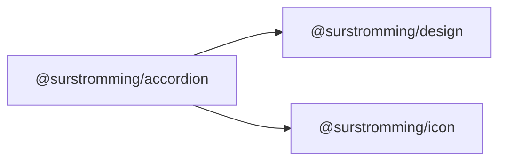

# @surstromming/accordion

Collapsible sections. Data-driven: pass items, get the whole accordion.

## Dependency graph



## Usage

```vue
<template>
  <Accordion v-model="open" :items="items" />

  <!-- markup instead of plain text: a slot named after the value -->
  <Accordion v-model="open" :items="items" multiple>
    <template #shipping>
      Ships in <strong>2–3 days</strong>.
    </template>
  </Accordion>
</template>

<script setup lang="ts">
import { ref } from 'vue'
import { Accordion, type AccordionItem } from '@surstromming/accordion'

const open = ref(['refunds'])
const items: AccordionItem[] = [
  { title: 'Is it refundable?', value: 'refunds', content: 'Yes, within 30 days.' },
  { title: 'How fast is shipping?', value: 'shipping' },
]
</script>
```

## Props

| Prop       | Type              | Default      | Notes                                     |
| ---------- | ----------------- | ------------ | ----------------------------------------- |
| `v-model`  | `string[]`        | `[]`         | The **open** values                        |
| `items`    | `AccordionItem[]` | — (required) | `{ title, value, content?, disabled? }`    |
| `multiple` | `boolean`         | `false`      | Allow several open at once                 |

The model is a `string[]` in **both** modes — single-open just replaces the
array instead of appending. One value type, so switching `multiple` on doesn't
change the shape of your state.

## Slots

One optional slot per item, named after its `value` — it replaces that item's
`content` when you need markup rather than text.

## Anatomy

```
div.root
  └─ div.item
       ├─ h3 > button.trigger   // title + chevron; aria-expanded
       └─ div.content           // grid 0fr → 1fr
            └─ div.contentInner // overflow: hidden
```

## The height animation

`grid-template-rows: 0fr → 1fr` on the content, with `overflow: hidden` on the
inner div. The section animates to the content's **real** height with no
`scrollHeight` measuring, no `ResizeObserver`, and no re-measure when the
content changes. Honours `prefers-reduced-motion`.

## Tokens

`border` divider per item, `muted-foreground` body and chevron, `radius(sm)`
focus ring (3px `ring`), 0.875rem type.

## Accessibility

Each trigger is a real `<button>` inside an `<h3>` (so headings navigation
works) carrying `aria-expanded`. Enter/Space toggle it natively.
