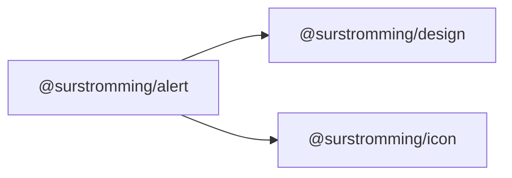

# @surstromming/alert

A callout that **stays on the page** — a form-level error, a warning above a
table. For something transient that appears and leaves, use
[`Toast`](../toast).

## Dependency graph



## Usage

```vue
<template>
  <Alert :icon="Terminal" title="Heads up!">
    You can add components to your app using the CLI.
  </Alert>

  <Alert variant="destructive" :icon="CircleAlert" title="Payment failed">
    Your card was declined. Try another one.
  </Alert>
</template>

<script setup lang="ts">
import { Alert } from '@surstromming/alert'
import { CircleAlert, Terminal } from 'lucide'
</script>
```

## Props

| Prop      | Type                    | Default | Notes                                 |
| --------- | ----------------------- | ------- | ------------------------------------- |
| `variant` | `info \| destructive`   | `info`  |                                       |
| `title`   | `string`                | —       | Omit for a description-only callout    |
| `icon`    | `IconNode`              | —       | A lucide icon; omit for no icon column |

## Slots

| Slot      | Description   |
| --------- | ------------- |
| `default` | The description — text, links, whatever. |

## Anatomy

```
div.root[role=alert]      // grid: [icon] [title / description]
  ├─ Icon
  ├─ p.title
  └─ div.description
```

The icon sits in its own grid column spanning both rows, so a wrapped
description lines up **under the title**, not under the icon.

## Tokens

`border` + `background`, `radius(md)`, 0.875rem type; description in
`muted-foreground`. `destructive` recolors the border (`destructive` @ 50%),
the title and the description.

## Accessibility

`role="alert"` — assistive tech announces it as soon as it appears. That's
right for something that shows up in response to an action (a failed save); if
the callout is always on the page as static guidance, pass `role="note"` (it
falls through) so it isn't announced out of turn.
