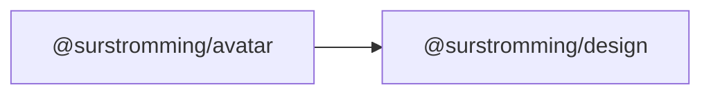

# @surstromming/avatar

A user's picture, with initials as a fallback. The image only appears once it
has actually loaded — a broken or slow `src` never flashes a missing-image
glyph.

## Dependency graph



## Usage

```vue
<template>
  <Avatar src="/users/ada.jpg" alt="Ada Lovelace" />
  <Avatar alt="Grace Hopper" />          <!-- no src → "GH" -->
  <Avatar fallback="?" size="lg" />
</template>

<script setup lang="ts">
import { Avatar } from '@surstromming/avatar'
</script>
```

## Props

| Prop       | Type              | Default | Notes                                          |
| ---------- | ----------------- | ------- | ---------------------------------------------- |
| `src`      | `string`          | —       | Loaded off-DOM first; shown only when ready     |
| `alt`      | `string`          | —       | Image alt **and** the source of auto-initials   |
| `fallback` | `string`          | —       | Overrides the initials derived from `alt`       |
| `size`     | `sm \| md \| lg`  | `md`    | 2rem / 2.5rem / 4rem                             |

Initials come from the first letter of the first two words of `alt` (`"Ada
Lovelace"` → `AL`), unless `fallback` is given.

## Composable

```ts
import { useImageStatus } from '@surstromming/avatar'

const status = useImageStatus(srcRef) // 'idle' | 'loading' | 'loaded' | 'error'
```

Preloads `src` and reports its state; re-runs when the ref changes and ignores
a stale load that resolves after `src` has moved on. Exported because the same
"show it only once it's ready" logic is useful beyond avatars.

## Anatomy

```
span.root                 // round, clips, muted fallback surface
  ├─ img.image            // when status === 'loaded'
  └─ span.fallback        // otherwise: initials
```

## Tokens

`muted` / `muted-foreground` fallback surface, pill radius, `object-fit: cover`
so a non-square image fills the circle without distortion.

## Accessibility

`alt` describes the person. A decorative avatar beside a name that's already in
text can pass `alt=""` so it isn't announced twice.
