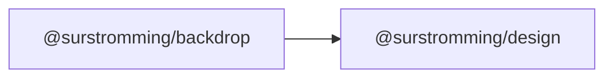

# @surstromming/backdrop

Dimmed full-screen overlay, teleported to `<body>`. Stays mounted; `visible`
fades it in and out.

Black at 50% **plus a 4px `backdrop-filter` blur**. The tint alone is what
shadcn ships, and it's enough on a light page — but in dark mode a dark panel
over a slightly-darker page has almost nothing to separate against. The blur is
what actually pushes the page behind glass, so the eye lands on what's on top of
it. It's a fixed neutral, not a theme token: a scrim that changed colour with
the theme would stop reading as "the lights went down".

## Dependency graph



## Usage

```vue
<template>
  <Backdrop :visible="open" @click="open = false" />
</template>

<script setup lang="ts">
import { Backdrop } from '@surstromming/backdrop'
</script>
```

**Props** — `visible`: `boolean` (default `false`) · `layer`:
`backdrop | sidebar | modal` (default `backdrop`).

`layer` names the rung of the stacking ladder rather than giving a number:
as a scrim it paints one step *under* the thing it dims (`sidebar` → 49,
`modal` → 69), and `backdrop` is the ladder's own rung for a scrim with
nothing on top of it. The values live in `zIndexes.scss`, so a consumer never
restates them.
