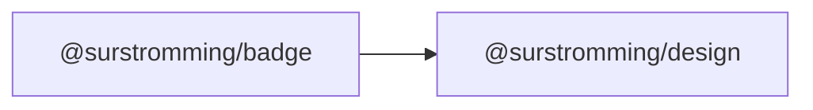

# @surstromming/badge

Small status label — a count, a state, a tag. Not interactive: if it can be
clicked, it's a [`Button`](../button).

## Dependency graph



## Usage

```vue
<template>
  <Badge>New</Badge>
  <Badge variant="secondary">Draft</Badge>
  <Badge variant="destructive">Failed</Badge>
  <Badge variant="outline">v1.2.0</Badge>
</template>

<script setup lang="ts">
import { Badge } from '@surstromming/badge'
</script>
```

## Props

| Prop      | Type                                                              | Default   | Notes                                       |
| --------- | ---------------------------------------------------------------- | --------- | ------------------------------------------- |
| `variant` | `primary \| secondary \| destructive \| outline \| ghost \| link` | `primary` |                                             |
| `as`      | `string`                                                          | `span`    | `a` / `RouterLink` makes it a link           |

`class` and everything else fall through to the root element.

**Hover states only apply when `as` makes it a link.** A plain badge is not
interactive, so `ghost`/`link` (and the hover on the others) do nothing until
it's an `<a>` — the CSS keys off `a&:hover`, so there's no dead affordance on a
static label.

## Slots

| Slot      | Description                                        |
| --------- | -------------------------------------------------- |
| `default` | Text, optionally an icon (`<svg>` sized to 0.75rem) |

## Tokens

Pill radius, `0.75rem/500` type. Backgrounds: `primary` / `secondary` /
`destructive` (white text, dark @ 60%); `outline` transparent with a `border`;
`ghost`/`link` transparent, revealing their colour only as a link.

## Accessibility

A badge is decoration next to something that names it. If it carries meaning on
its own ("3 unread"), make sure that meaning also exists in text a screen
reader reaches — don't rely on colour alone.
