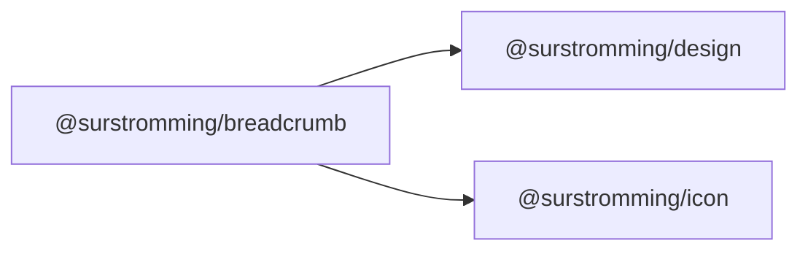

# @surstromming/breadcrumb

The trail back up the hierarchy. Data-driven: pass the path, get the trail.

## Dependency graph



## Usage

```vue
<template>
  <Breadcrumb :items="items" />
</template>

<script setup lang="ts">
import { Breadcrumb, type BreadcrumbItem } from '@surstromming/breadcrumb'

const items: BreadcrumbItem[] = [
  { label: 'Home', to: '/' },
  { label: 'Components', href: '/components' },
  { label: 'Breadcrumb' }, // no target → the current page
]
</script>
```

## Props

| Prop       | Type               | Default      | Notes                                              |
| ---------- | ------------------ | ------------ | -------------------------------------------------- |
| `items`    | `BreadcrumbItem[]` | — (required) | `{ label, href?, to? }`                             |
| `maxItems` | `number`           | `0` (off)    | Collapse the middle to an ellipsis past this length |

With `maxItems`, the **root and the tail stay**; the middle folds into a single
ellipsis (`maxItems - 1` trailing items remain visible). The two ends are what
tell you where you are and where you came from.

```ts
export interface BreadcrumbItem {
  label: string
  href?: string           // plain link
  to?: RouteLocationRaw   // vue-router link
}
```

**An item with no `href`/`to` is the current page** — it renders as text with
`aria-current="page"` instead of a link. That's the rule the whole component
runs on; there's no `isCurrent` flag to keep in sync with reality.

## Anatomy

```
nav[aria-label=Breadcrumb]
  └─ ol.list
       └─ li.item        // link or current + chevron separator
```

## Tokens

Links in `muted-foreground` → `foreground` on hover; the current page is
`foreground`/500. Separator is a lucide chevron at 0.875rem.

## Accessibility

`<nav aria-label="Breadcrumb">` wrapping an ordered list — the structure *is*
the semantics. Separators are `<svg>` icons inside the list item, and `Icon`
marks them `aria-hidden` unless labelled, so they aren't read aloud.

## Notes

The collapsed ellipsis is **static** — the hidden items aren't reachable from
it. A dropdown that reveals them needs a menu component and is a later
addition; for now, if the middle matters, don't set `maxItems`.
