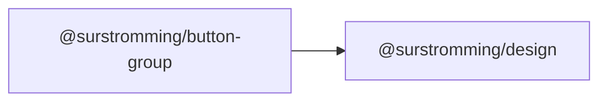

# @surstromming/button-group

Joins buttons into one control: the inner corners square off, the shared edge is
drawn once instead of twice, and the outer corners keep the usual radius.

It's a **layout wrapper, not a data-driven component** — the exception the rest
of the library's "pass an array" rule allows for. What goes in a group isn't a
list of one shape: it's a `Button`, then another, then a `DropdownMenu` trigger,
then maybe a `Select`. A slot takes all of those; an `items` array would only
take the first.

The group holds no state either. Which button is pressed, what a split button's
menu contains — that's the consumer's, exactly as it is with a bare `Button`.

## Dependency graph



Deliberately **not** a dependency of `@surstromming/button`: the group styles
whatever it's given as elements, so it works with a Button, a link, or a
component from outside this library.

## Usage

```vue
<template>
  <ButtonGroup>
    <Button variant="outline">Copy</Button>
    <Button variant="outline">Paste</Button>
    <Button variant="outline">Cut</Button>
  </ButtonGroup>
</template>

<script setup lang="ts">
import { Button } from '@surstromming/button'
import { ButtonGroup } from '@surstromming/button-group'
</script>
```

A split button is the same shape — a normal action, then a menu trigger:

```vue
<ButtonGroup>
  <Button>Save</Button>
  <DropdownMenu :items="options" @select="run">
    <template #trigger="{ toggle }">
      <Button aria-label="More options" @click="toggle">
        <Icon :icon="ChevronDown" :size="16" />
      </Button>
    </template>
  </DropdownMenu>
</ButtonGroup>
```

## Props

| Prop          | Type                     | Default        | Notes                        |
| ------------- | ------------------------ | -------------- | ---------------------------- |
| `orientation` | `horizontal \| vertical` | `horizontal`   | Which way the buttons stack  |

### Slots

| Slot      | Description                                        |
| --------- | -------------------------------------------------- |
| `default` | The buttons, in order. First and last get the round corners. |

### Fallthrough

`class`, `style`, `aria-label` and listeners land on the root, which carries
`role="group"` — label it when the grouping means something ("Text alignment").

## How it styles children it can't name

CSS Modules hash every class, so the group can't reach `Button`'s own
`border-radius` by name — it selects children as **elements** (`> *`) instead.
That's also why each rule is written with **both** root classes
(`.root.orientation-horizontal > *`): a single class only *ties* with Button's
own rule, and a tie is settled by whichever package's CSS was injected last.
Two classes win outright, so the group's radii don't depend on bundler order.

The seam is closed with a `-1px` margin rather than by removing a border — the
group doesn't know whether its children have one. On hover and focus the child
is raised (`z-index: 1`) so a focus ring isn't half-covered by its neighbour.

## Deliberately not here

| Missing                     | Why                                                        |
| --------------------------- | ---------------------------------------------------------- |
| `ButtonGroupText` (shadcn)  | A `<span>` with your own class. It would be a component that exists only to hold padding. |
| `ButtonGroupSeparator`      | [`Separator`](../separator) already draws a line; drop one between children and it's joined like anything else. |
| A selected/active state     | That's a `Tabs` (one of several views) or a toggle group (a value), not a group of independent actions. |

## Accessibility

`role="group"` and nothing else — the children are already real buttons, so
Tab, Enter and Space are the browser's. There's no roving `tabindex`: these are
independent actions, and skipping the ones you didn't focus would hide them.
(`Tabs` does have one, because a tablist is a single control.)
