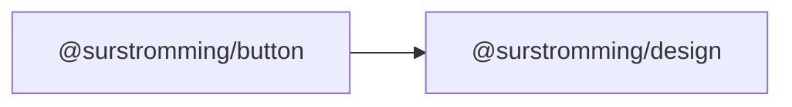

# @surstromming/button

Button with shadcn's variants and sizes. Renders a native `<button>` by
default, or any element/component via `as`.

## Dependency graph



## Usage

```vue
<template>
  <Button @click="save">Save</Button>
  <Button variant="outline" size="sm">Cancel</Button>
  <Button variant="ghost" size="icon" aria-label="Add"><Icon :icon="Plus" /></Button>
  <Button as="a" href="/docs" variant="link">Docs</Button>
</template>

<script setup lang="ts">
import { Button } from '@surstromming/button'
import { Icon } from '@surstromming/icon'
import { Plus } from 'lucide'
</script>
```

## Props

| Prop       | Type                                                                | Default    | Notes                                                              |
| ---------- | ------------------------------------------------------------------- | ---------- | ------------------------------------------------------------------ |
| `variant`  | `primary \| secondary \| destructive \| outline \| ghost \| link`    | `primary`  | `ButtonVariant`                                                     |
| `size`     | `sm \| md \| lg \| icon`                                             | `md`       | `ButtonSize`                                                        |
| `as`       | `string`                                                             | `button`   | Any tag — `a`, `label`, `RouterLink`…                               |
| `type`     | `button \| submit \| reset`                                          | `button`   | Emitted only when `as` is `button`                                  |
| `disabled` | `boolean`                                                            | `false`    | Native `disabled` on a `button`, else `aria-disabled="true"`        |

Types are exported alongside the component:

```ts
import { Button, type ButtonVariant, type ButtonSize } from '@surstromming/button'
```

### Slots

| Slot      | Description                                                    |
| --------- | -------------------------------------------------------------- |
| `default` | Label and/or icons. Direct `<svg>` children never shrink.       |

### Fallthrough

`class`, `@click`, `aria-*`, `form`, `name`, `value`, `data-*` land on the root
element (`inheritAttrs: true`). A consumer's `class` composes with the internal
CSS-module classes rather than replacing them.

## Anatomy

```
button.root                 // layout, radius, typography, focus ring, disabled
  ├─ .variant-<variant>     // border, background, color, hover, focus ring color
  └─ .size-<size>           // height, padding, gap
```

Styles live in three files — [`Button.vue`](src/Button.vue) (base),
[`css/button-variants.scss`](src/css/button-variants.scss),
[`css/button-sizes.scss`](src/css/button-sizes.scss). Partials compile **before**
the SFC block, so the base only declares what no variant overrides; a
variant-owned property (border, focus ring color) is written out in **every**
variant.

## Sizes

| Size   | Height          | Padding (inline) | With a direct `<svg>` child |
| ------ | --------------- | ---------------- | --------------------------- |
| `sm`   | `spacing(8)` 2rem   | `spacing(3)`  | `spacing(2.5)`              |
| `md`   | `spacing(9)` 2.25rem | `spacing(4)` | `spacing(3)`               |
| `lg`   | `spacing(10)` 2.5rem | `spacing(6)` | `spacing(4)`               |
| `icon` | `spacing(9)` square  | —            | —                           |

`icon` is a square button for a lone icon — always give it an `aria-label`.
Text/icon buttons tighten their padding when a `<svg>` sits directly in the
slot (`:has(> svg)`), matching shadcn's `has-[>svg]:px-*`.

## Tokens

Colors come from `@surstromming/design`; the component hardcodes none. Dark
values are the `data-theme="dark"` overrides of the same custom properties.

| Variant       | Background                        | Foreground             | Hover                        | Focus ring          |
| ------------- | --------------------------------- | ---------------------- | ---------------------------- | ------------------- |
| `primary`     | `primary`                         | `primary-foreground`   | `primary` @ 90%              | `ring` @ 50%        |
| `secondary`   | `secondary`                       | `secondary-foreground` | `secondary` @ 80%            | `ring` @ 50%        |
| `destructive` | `destructive` (dark: @ 60%)       | white                  | `destructive` @ 90%          | `destructive` @ 20% (dark: 40%) |
| `outline`     | `background` (dark: `input` @ 30%) | inherited              | `accent` (dark: `input` @ 50%) | `ring` @ 50%      |
| `ghost`       | transparent                       | inherited              | `accent` (dark: @ 50%)       | `ring` @ 50%        |
| `link`        | transparent                       | `primary`              | underline                    | `ring` @ 50%        |

Shared by every variant: `radius(md)`, `font-size: 0.875rem`, `font-weight: 500`,
and a 3px focus ring plus a `ring`-colored border on `:focus-visible` only —
mouse clicks never draw it.

## Icons

The slot's direct `<svg>` children get `flex-shrink: 0` and
`pointer-events: none`; they inherit the button's `currentColor` and its
`1em` (14px) font size. shadcn renders icons at 16px — pass an explicit size
when you need to match it exactly:

```vue
<Button><Icon :icon="Mail" :size="16" /> Login with Email</Button>
```

## Accessibility

- Renders a real `<button>`, so Enter/Space, form submission and focus order
  are native.
- `:focus-visible` (not `:focus`) draws the ring — keyboard users see it,
  mouse users don't.
- `size="icon"` has no text: **`aria-label` is required**.
- `disabled` on a native button sets the DOM property (removed from the tab
  order). On any other element (`as="a"`) it sets `aria-disabled="true"` —
  visual + assistive-tech state, but you must still prevent the action
  yourself; a disabled link is not a native concept.
- `pointer-events: none` while disabled blocks clicks and hover.

## Recipes

```vue
<!-- Submit a form -->
<Button type="submit" form="profile">Save changes</Button>

<!-- Router link that looks like a button -->
<Button :as="RouterLink" to="/settings" variant="outline">Settings</Button>

<!-- Destructive confirmation -->
<Button variant="destructive" @click="remove">Delete account</Button>

<!-- Loading state: the consumer owns it -->
<Button :disabled="saving">
  <Spinner v-if="saving" /> {{ saving ? 'Saving…' : 'Save' }}
</Button>
```

## Notes

- No `loading` prop — a spinner in the slot plus `:disabled` composes the same
  thing without a second source of truth.
- Custom width/margins belong to the consumer's `class`, not to props.
