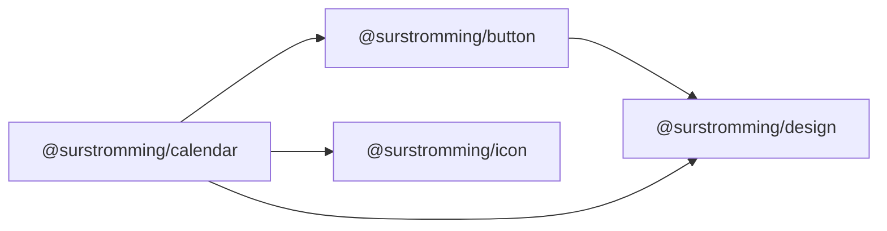

# @surstromming/calendar

A month grid for picking a single date. It renders the month, pages between
months, and reports the day you click — nothing else. No popover, no text field:
that's [`DatePicker`](../date-picker), which composes this one.

Dates are plain `Date` objects at local midnight; month and weekday names come
from `Intl.DateTimeFormat`, so there's no date library and no locale table.

## Dependency graph



Day cells and the paging chevrons **reuse `Button`** (`primary` for the
selected day, `ghost` otherwise, all `size="icon"`) — exactly its existing
paint, as in [`Pagination`](../pagination).

## Usage

```vue
<template>
  <Calendar v-model="date" :min="today" :is-disabled="isWeekend" />
</template>

<script setup lang="ts">
import { ref } from 'vue'
import { Calendar } from '@surstromming/calendar'

const date = ref<Date | null>(null)
const today = new Date()
const isWeekend = (day: Date) => day.getDay() === 0 || day.getDay() === 6
</script>
```

## Props

| Prop             | Type                       | Default    | Notes                                             |
| ---------------- | -------------------------- | ---------- | ------------------------------------------------- |
| `v-model`        | `Date \| null`             | `null`     | The selected day                                  |
| `v-model:month`  | `Date`                     | this month | Any date inside the visible month                 |
| `min`            | `Date`                     | —          | Earlier days are disabled                         |
| `max`            | `Date`                     | —          | Later days are disabled                           |
| `isDisabled`     | `(date: Date) => boolean`  | —          | Rule out individual days                          |
| `weekStartsOn`   | `sunday \| monday`         | `monday`   | Which column the week starts in                   |
| `locale`         | `string`                   | —          | BCP 47 tag; omitted means the browser's            |

### Fallthrough

`class`, `style` and listeners land on the root `div`.

## Anatomy

```
root
├── header   ‹ chevron · "July 2026" · chevron ›
└── grid     7 columns
    ├── weekday × 7
    └── 42 cells — six rows, always
```

Six rows always, so the grid keeps one height whatever month is shown and a
popover never resizes as you page.

Days spilling in from the neighbouring months render as plain muted spans, not
buttons: they're context, and making them selectable would triple the tab stops
for a click you can already make by paging.

Setting `v-model` from outside (a preset, a text field) pages the grid to that
month — a selection you can't see isn't one.

## Tokens

| Part         | Token                                     |
| ------------ | ----------------------------------------- |
| selected day | `Button` `primary`                        |
| today        | `inset 0 0 0 1px border` — a ring, since the fill means "selected" |
| weekday, outside day | `muted-foreground` (outside at 50%) |

## Accessibility

Every selectable day is a real `<button>`, so Tab and Enter work with no script.
Today carries `aria-current="date"`, the selected day `aria-pressed`, and the
chevrons are labelled. There's no roving `tabindex` — the month is 30 tab stops,
which is the honest cost of the simplest correct markup.
