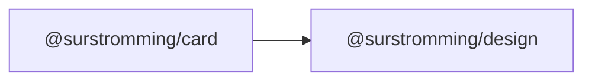

# @surstromming/card

A surface that groups related content — a stat, a form, a preview. Layout
only: header, body and footer sections with the card's padding and rhythm.

## Dependency graph



## Usage

```vue
<template>
  <Card title="Create project" description="Deploy in one click.">
    <Input v-model="name" placeholder="Project name" />

    <template #footer>
      <Button variant="outline">Cancel</Button>
      <Button>Deploy</Button>
    </template>
  </Card>
</template>

<script setup lang="ts">
import { Card } from '@surstromming/card'
import { Button } from '@surstromming/button'
import { Input } from '@surstromming/input'
</script>
```

## Props

| Prop          | Type     | Default | Notes                                      |
| ------------- | -------- | ------- | ------------------------------------------ |
| `title`       | `string` | —       | Convenience for the common header title     |
| `description` | `string` | —       | Sub-text under the title                    |

## Slots

| Slot      | Description                                                        |
| --------- | ----------------------------------------------------------------- |
| `default` | The body.                                                          |
| `header`  | Replaces the `title`/`description` pair when you need markup.       |
| `footer`  | Actions row — omitted entirely when not provided.                  |

The header renders if there's a `header` slot **or** either text prop; the
footer only when its slot is filled — no empty padded bands.

## Anatomy

```
div.root                 // border, radius(xl), card surface, shadow(sm)
  ├─ div.header          // title + description (or #header)
  ├─ div.content         // <slot />
  └─ div.footer          // #footer, only if present
```

## Tokens

`card` / `card-foreground` surface, `border`, `radius(xl)`, `shadow(sm)`.
Sections share `spacing(6)` inline padding; a `spacing(6)` gap sets the
vertical rhythm. Description in `muted-foreground`.
