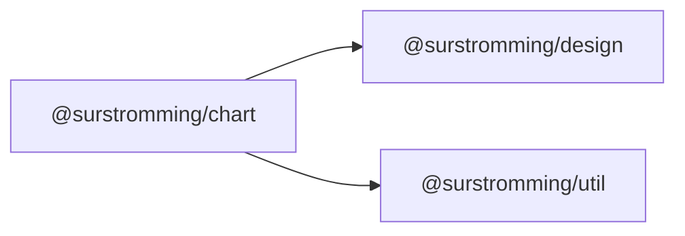

# @surstromming/chart

Line, area and bar charts drawn as plain SVG — no charting library. One
component, driven by data: rows in, marks out, with a hover tooltip.

## Dependency graph



## Usage

```vue
<template>
  <Chart type="bar" :data="visits" :series="series" x-key="month" />
</template>

<script setup lang="ts">
import { Chart, type ChartSeries } from '@surstromming/chart'

const series: ChartSeries[] = [
  { key: 'desktop', label: 'Desktop' },
  { key: 'mobile', label: 'Mobile' },
]

const visits = [
  { month: 'Jan', desktop: 186, mobile: 80 },
  { month: 'Feb', desktop: 305, mobile: 200 },
  { month: 'Mar', desktop: 237, mobile: 120 },
]
</script>
```

## Props

| Prop          | Type                        | Default | Notes                                        |
| ------------- | --------------------------- | ------- | -------------------------------------------- |
| `data`        | `ChartRow[]`                | —       | One row per x position                       |
| `series`      | `ChartSeries[]`             | —       | `{ key, label, color? }`, drawn in this order |
| `xKey`        | `string`                    | —       | Property holding the x label                 |
| `type`        | `line \| area \| bar`       | `line`  |                                              |
| `height`      | `number`                    | `240`   | Pixels; the width comes from the container   |
| `formatValue` | `(value: number) => string` | —       | Axis and tooltip numbers                     |

The width is measured with a `ResizeObserver`, so the chart fills whatever it's
put in and redraws on resize. Non-numeric cells count as `0`.

### Fallthrough

`class`, `style` and listeners land on the root `div`.

## Anatomy

```
root (relative)
├── svg
│   ├── grid + y labels     four "nice" ticks — 1/2/5 × a power of ten
│   ├── x labels            thinned out rather than overlapped
│   ├── crosshair / band highlight   under the pointer
│   ├── marks               area fills, then lines, then bars
│   ├── markers             only on the hovered point
│   └── hit bands           one per row, full height, transparent
├── tooltip                 follows the band, clamped to the plot
└── legend                  from two series up
```

Zero is always in the range — a bar chart that doesn't start at zero lies about
its proportions.

Hit targets are one full-height transparent rect per row, so the tooltip
appears anywhere over the column instead of only on a 2px line.

## Color

Series take `chart-1…5` from the design package **in order, never cycled** —
slot 1 is always the first series, so filtering the data can't repaint the
survivors. Those five steps are validated as a set: each sits inside the
lightness band, clears the chroma floor, stays ≥ 3:1 against the surface, and
every adjacent pair survives simulated deuteranopia. Dark values are chosen
against the dark surface, not flipped.

Past five series, pass `color` explicitly — but the honest fix is fewer series:
fold the tail into "Other", or use small multiples.

## Deliberately not here

| Missing            | Why                                                          |
| ------------------ | ------------------------------------------------------------ |
| A second y axis    | Two scales on one plot is the single most misread chart there is. Two measures → two charts, or index both to a common base. |
| Stacked bars       | Grouped answers "compare the parts"; stacking answers a different question and needs its own segment gaps and tooltip. |
| Pie / donut        | Angles read worse than lengths. A bar chart says it better.  |
| Curve smoothing    | An interpolated curve invents values between the points.     |

## Accessibility

The `svg` is `role="img"` with a label naming the type and the series. From two
series up a legend is always present, so identity is never carried by color
alone; the tooltip repeats label and value as text. Values live in the
consumer's `data` — render it as a `Table` beside the chart when the numbers
matter as much as the shape.
