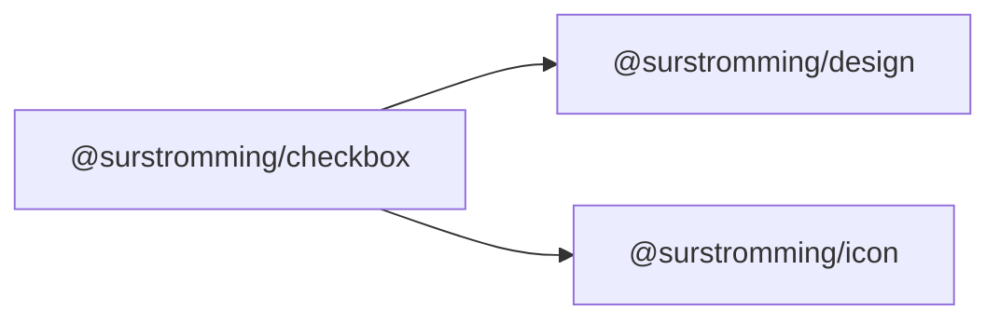

# @surstromming/checkbox

Checkbox. A native `<input type="checkbox">` made invisible on top of a drawn
box — so keyboard, click, form submission and `:checked` stay native, and only
the paint is ours.

## Dependency graph



## Usage

```vue
<template>
  <Label for="terms">
    <Checkbox id="terms" v-model="agreed" /> Accept terms and conditions
  </Label>
</template>

<script setup lang="ts">
import { ref } from 'vue'
import { Checkbox } from '@surstromming/checkbox'

const agreed = ref(false)
</script>
```

## Props

| Prop      | Type      | Default | Notes             |
| --------- | --------- | ------- | ----------------- |
| `v-model` | `boolean` | —       | `defineModel()`   |
| `indeterminate` | `boolean` | `false` | Shows a dash — "some of the things below are checked" |

`id` · `disabled` · `required` · `name` · `value` · `aria-invalid` and every
other attribute **fall through to the inner `<input>`** (`inheritAttrs: false`)
— it's the interactive element, so that's where a `Label`'s `for` must land.

## Anatomy

```
span.root         // 1rem square, positioning context
  ├─ input.input  // the real checkbox: invisible, on top, receives every event
  └─ span.box     // the painted box + check icon
```

## States & tokens

| State              | Border        | Background | Icon                 |
| ------------------ | ------------- | ---------- | -------------------- |
| resting            | `input`       | —          | —                    |
| `:checked`         | `primary`     | `primary`  | `primary-foreground` |
| `:indeterminate`   | `primary`     | `primary`  | `primary-foreground` |
| `:focus-visible`   | `ring`        | —          | —                    |
| `[aria-invalid]`   | `destructive` | —          | —                    |
| `:disabled`        | —             | —          | 50% opacity          |

Size `spacing(4)` (1rem), `radius(sm)`, 3px focus ring, check icon at 14px.

## Accessibility

- It **is** a native checkbox: Space toggles it, it submits with the form, and
  screen readers announce the real state — no `role`/`aria-checked` juggling.
- Give it an `id` and point a [`Label`](../label) at it, or nest it inside the
  label as above.
- Indeterminate state isn't supported yet; it needs a DOM property (not an
  attribute) and a third model value.

## Indeterminate

`indeterminate` is a *display* state, not a third value. `v-model` stays a
boolean and a click still resolves to one — what that click should mean (select
all? clear all?) is the consumer's call, which is why the prop is one-way.

It's a DOM property with no attribute behind it, so Vue can't bind it; the
component assigns it to the real input, which is what lets CSS style it through
`:indeterminate` and what screen readers read as `aria-checked="mixed"`.

[`DataTable`](../data-table) is the reason it exists: its header checkbox shows
a dash when only some rows on the page are selected.
