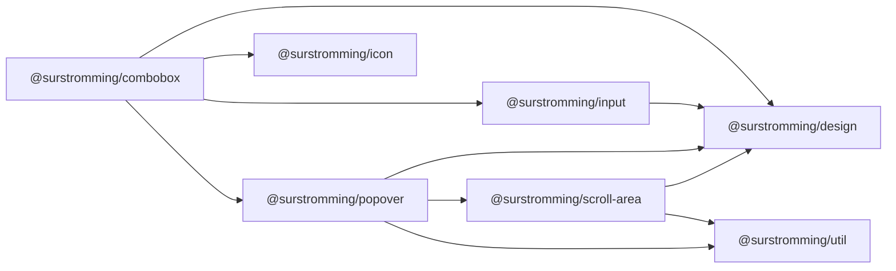

# @surstromming/combobox

A [`Select`](../select) with a search field — for lists too long to scan.
Data-driven: pass options, get the whole control.

## Dependency graph



## Usage

```vue
<template>
  <Combobox v-model="framework" :options="frameworks" placeholder="Pick a framework" />
</template>

<script setup lang="ts">
import { ref } from 'vue'
import { Combobox, type ComboboxOption } from '@surstromming/combobox'

const framework = ref('')
const frameworks: ComboboxOption[] = [
  { label: 'Vue', value: 'vue' },
  { label: 'Svelte', value: 'svelte' },
  { label: 'Angular', value: 'angular', disabled: true },
]
</script>
```

## Props

| Prop                | Type               | Default          | Notes                             |
| ------------------- | ------------------ | ---------------- | --------------------------------- |
| `v-model`           | `string`           | —                | The selected `value`               |
| `options`           | `ComboboxOption[]` | — (required)     | `{ label, value, disabled? }`      |
| `placeholder`       | `string`           | `Select…`        | Trigger text before a choice       |
| `searchPlaceholder` | `string`           | `Search…`        |                                    |
| `emptyText`         | `string`           | `Nothing found.` | Shown when nothing matches         |
| `disabled`          | `boolean`          | `false`          |                                    |
| `layer`             | `popover \| menu \| modal` | `popover` | Rung of the stacking ladder      |

`layer` is forwarded to [`Popover`](../popover). Inside a
[`Dialog`](../dialog) pass `modal`, or the panel is drawn at 30 under a dialog
at 70.

`id` · `aria-*` fall through **to the trigger button** (`inheritAttrs: false`).

## Anatomy

```
Popover
  ├─ button.trigger        // value + up/down chevrons
  ├─ div.search > Input    // focused on open; cleared on close
  └─ ul.list[role=listbox]
       ├─ li.option        // filtered by the query
       └─ li.empty         // emptyText
```

## Behavior & keyboard

| Key                | Action                                             |
| ------------------ | -------------------------------------------------- |
| `↓` / `Enter` / `Space` (trigger) | Open                                |
| `↓` / `↑` (search) | Move the active option (skips disabled)             |
| `Enter` (search)   | Pick the active option                              |
| `Escape`           | Close (from `Popover`)                              |
| outside click      | Close (from `Popover`)                              |

- Opening **focuses the search field** — otherwise it's a select with extra
  steps. Closing clears the query, so the next open starts fresh.
- Filtering is a case-insensitive substring match on `label`. Re-filtering
  resets the highlight to the first match, so `Enter` always picks what you're
  looking at.

## Notes

- Filtering is client-side over the `options` you pass. For a remote search,
  keep the query in your own state, refetch, and hand the new array back in —
  the component re-renders from it.
- Single-select only, like `Select`.
