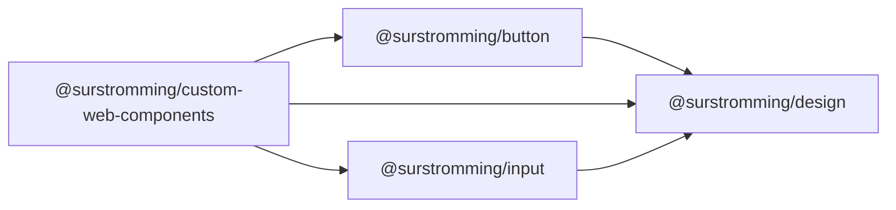

# @surstromming/custom-web-components

Selected components compiled as framework-agnostic **custom elements** — usable
in plain HTML, React, Angular, or anywhere.

The repo's **one compiled package**: every other package ships raw `.vue`
source for consumers who share our Vite/Sass pipeline. A custom-element consumer
doesn't, so this one is built to `dist/`. Vue is a **peer dependency** — the
consumer provides it (the bundle imports it, doesn't ship it).

## Dependency graph



## Exports

| Path      | What                                                             |
| --------- | ---------------------------------------------------------------- |
| `.`       | Re-exports every component (currently `Button`).                 |
| `./button`| Just `Button`.                                                   |
| `./util`  | `defineElement`, `register`, `trackTheme` / `untrackTheme`.       |

The package ships **components**, not pre-made element classes — the consumer
turns a component into an element and names the tag:

```ts
import { Button } from '@surstromming/custom-web-components'
import { defineElement } from '@surstromming/custom-web-components/util'

customElements.define('ss-button', defineElement(Button))
```

```html
<ss-button variant="outline" size="lg">Click me</ss-button>
```

`register()` does several at once (still the consumer's call, with their prefix):

```ts
import { Button } from '@surstromming/custom-web-components'
import { register } from '@surstromming/custom-web-components/util'

register({ button: Button })          // <ss-button>
register({ button: Button }, 'acme')  // <acme-button>
```

Attributes map to props (`variant`, `size`, `disabled`); light-DOM children
project through `<slot>`; DOM events fire natively — it's a real `<button>`.

The **demo lives in the app** at `src/pages/webcomponents` (route
`/webcomponents`): `webComponentsRegister.ts` defines the tag, `WebComponents.vue`
uses it. The app's Vite marks `<ss-*>` as custom elements
(`isCustomElement`) so Vue leaves them alone.

## Theming (opt-in)

Design tokens are inherited CSS custom properties, so the dark theme's *values*
cross into the shadow root for free — dark is already token-correct. A
component's *dark-gated* rules, though, compile to `:host([data-theme='dark'])`,
which matches only when the attribute is on the host. `trackTheme(hostEl)`
mirrors `<html data-theme>` onto a host to switch those on:

```ts
import { trackTheme } from '@surstromming/custom-web-components/util'
// e.g. from a wrapper element's connectedCallback, or over document.querySelectorAll('ss-button')
```

It's deliberately **not** wired into `defineElement` — the theme source/selector
may be computed differently per app, so this is left as a seam.

## How the shadow DOM is made to work

The components use `<style module>`, which `@vitejs/plugin-vue` refuses to
compile in shadow-DOM (`customElement: true`) mode. Two build-time moves fix it,
with **no component changes**:

1. **Strip the `module` attribute** (a `pre` Vite plugin). Shadow DOM isolates
   class names per element, so hashing is pointless — the block compiles as
   plain CSS (`.root`, `.variant-primary`) injected into the shadow root.
2. **Identity `useCssModule()`** (a `vue` alias to `src/vue-shim.ts`) so
   `$style.x` returns `'x'`, matching those plain names. The alias must win over
   externalization — only the shim's deep `vue/dist/…` import is external, never
   bare `vue`, or Rollup would externalize it before the alias runs.

`process.env.NODE_ENV` is inlined to `production` (no consumer bundler defines
it for a direct-browser path).

### Shadow reset

The app's global `reset.scss` can't cross into a shadow root, so the inner
controls would fall back to user-agent styling (grey `buttonface`, Arial,
native chrome). `defineElement` injects a small button/anchor slice of that
reset as the **first** style in each shadow root; the component's own styles
follow and override where they set things (a variant's own background/color
wins; a variant that sets neither — `ghost`, `link` — keeps the reset's
transparent/`inherit`). Not the whole `reset.scss` — that emits `@font-face`
and `body` rules that don't belong in a shadow root.

## Build

`npm run build --workspace=@surstromming/custom-web-components` → `dist/`
(one entry per component, a barrel, `util`, the shim chunk). No CSS file —
each element injects its own styles into its shadow root. Rebuild after
changing source; the app consumes `dist/` (types resolve to `src/` via the
package's export conditions).

## Notes

- Leaf, presentational components are the right fit. Teleport-based ones
  (dialog, toast, sidebar) escape the shadow root; array-prop components
  (`options`-driven) can't take data from HTML attributes. Neither is in scope.
- Assumes a component reads classes via `useCssModule()` (the repo's `classes`
  convention). One using the template `$style` magic var directly would need
  the shim extended.
