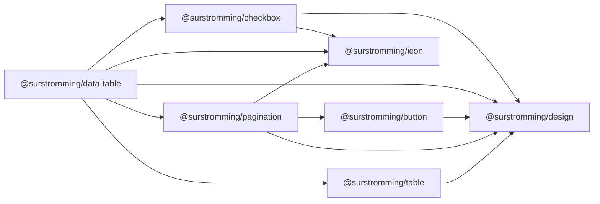

# @surstromming/data-table

`Table` with the state wired up: client-side **sorting**, **pagination** and
**row selection**. The paint stays in `Table`, the page controls in
`Pagination`, the checkboxes in `Checkbox` — this package owns only the state
and the composition.

## Dependency graph



## Usage

```vue
<template>
  <DataTable
    :columns="columns"
    :rows="payments"
    row-key="id"
    :page-size="10"
    selectable
    v-model:selected="selected"
  >
    <template #cell-status="{ value }">
      <Badge variant="outline">{{ value }}</Badge>
    </template>
  </DataTable>
</template>

<script setup lang="ts">
import { ref } from 'vue'
import { DataTable, type DataTableColumn } from '@surstromming/data-table'

const columns: DataTableColumn[] = [
  { key: 'status', header: 'Status', sortable: true },
  { key: 'email', header: 'Email', sortable: true },
  { key: 'amount', header: 'Amount', align: 'right', sortable: true },
]

const payments = [
  { id: 'm5gr84i9', status: 'success', email: 'ken99@example.com', amount: 316 },
  /* … */
]

const selected = ref<(string | number)[]>([])
</script>
```

## Props

| Prop               | Type                    | Default      | Notes                                             |
| ------------------ | ----------------------- | ------------ | ------------------------------------------------- |
| `columns`          | `DataTableColumn[]`     | — (required) | `TableColumn` plus `sortable?`                    |
| `rows`             | `TableRow[]`            | — (required) | The full data set, unsorted and unpaged           |
| `rowKey`           | `string`                | — (required) | Column key with unique values — selection and page keys need identity |
| `pageSize`         | `number`                | — (off)      | Rows per page; absent → no pagination             |
| `selectable`       | `boolean`               | `false`      | Prepends the checkbox column                      |
| `caption`, `empty` | `string`                | —            | Passed through to `Table`                         |
| `v-model:sort`     | `DataTableSort \| null` | `null`       | Bind it or leave it internal                      |
| `v-model:page`     | `number`                | `1`          | 1-based; bind it or leave it internal             |
| `v-model:selected` | `(string \| number)[]`  | `[]`         | `row[rowKey]` values, raw (not stringified)       |

```ts
export interface DataTableColumn extends TableColumn {
  sortable?: boolean
}

export type SortDirection = 'asc' | 'desc'

export interface DataTableSort {
  key: string
  direction: SortDirection
}
```

Every model works standalone — `defineModel` keeps local state when the parent
doesn't bind, so `<DataTable :columns :rows row-key="id" :page-size="10" />`
just works.

## Sorting

A `sortable` column's header is a button: label plus an arrows icon
(`ArrowUpDown` idle, `ArrowUp`/`ArrowDown` active). Clicking it sorts `asc`,
clicking again flips to `desc` — a two-state toggle, no third "unsorted" click.

Comparison: two numbers compare numerically, anything else as
`String(a).localeCompare(String(b))`; nullish values sort last. No custom
comparators in v1 — pre-format into a sortable shape or keep the column
unsortable.

**Client-side only.** For server-side sorting/paging, compose `Table` +
`Pagination` yourself — this component's contract is "give me all the rows".

## Pagination

`pageSize` slices the (sorted) rows and renders `Pagination` under the table,
right-aligned. `pageCount` is derived; when `rows` shrink below the current
page, the visible page clamps (the model is not written back). Sorting resets
`page` to 1 — the row you were looking at is no longer where it was.

## Selection

`selectable` prepends a checkbox column. The header checkbox toggles the
**current page's** rows; it shows checked only when every row on the page is
selected, and a dash (`Checkbox`'s `indeterminate`) when only some are.
Selection survives page and sort changes — it's keyed by `row[rowKey]`, not by
position. Selected rows get the `muted` background via `Table`.

## Slots

| Slot         | Props            | Description                            |
| ------------ | ---------------- | -------------------------------------- |
| `cell-<key>` | `{ row, value }` | Forwarded to `Table` — same contract.  |

## Anatomy

```
div.root
  ├─ Table                 // #head-<key> fills sort buttons + select-all,
  │                        // #cell-__select fills row checkboxes
  └─ div.footer            // only with pageSize: selection count + Pagination
```

The selection column's key is `__select` — reserved; a data column named
`__select` is a consumer error.

## Required Table additions

Two small, backwards-compatible extensions to `@surstromming/table` ship with
this component:

- **`#head-<key>="{ column }"` slots** — the header-cell mirror of
  `#cell-<key>`; the string `header` stays the default content.
- **`selectedKeys?: (string | number)[]` prop** — rows whose `row[rowKey]`
  is listed get the selected background. Paint only; Table still holds no
  state.

## Tokens

Nothing of its own beyond `spacing` for the footer row — colors come from
`Table`, `Pagination`, `Checkbox`.

## Accessibility

- Sort headers are real `<button>`s inside `<th>` — keyboard comes free.
- Checkboxes are real inputs (`Checkbox`), labelled "Select row" /
  "Select all on page".
- `aria-sort` is skipped in v1: the attribute belongs on `<th>`, which the
  head slot doesn't reach.

## Notes

- **No filtering** — `rows` is a prop; filter before passing
  (`:rows="rows.filter(…)"`). A search input is app UI, not table state.
- No column visibility, resizing or pinning — out of scope for v1.
- The selection count ("3 of 20 row(s) selected") renders only alongside
  pagination in the footer; without `pageSize`, bind `v-model:selected` and
  render your own.
