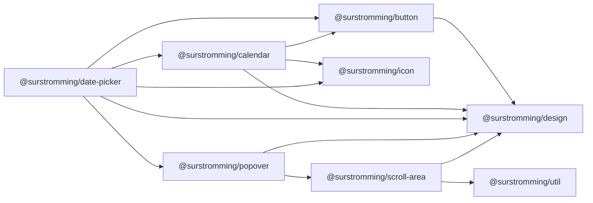

# @surstromming/date-picker

A field-shaped trigger that opens a [`Calendar`](../calendar) in a
[`Popover`](../popover). Pure composition — it owns the open state, the label,
and nothing else.

## Dependency graph



## Usage

```vue
<template>
  <Label id="due-label">Due date</Label>
  <DatePicker v-model="due" :min="today" aria-labelledby="due-label" />
</template>

<script setup lang="ts">
import { ref } from 'vue'
import { DatePicker } from '@surstromming/date-picker'

const due = ref<Date | null>(null)
const today = new Date()
</script>
```

## Props

| Prop            | Type                       | Default        | Notes                                        |
| --------------- | -------------------------- | -------------- | -------------------------------------------- |
| `v-model`       | `Date \| null`             | `null`         | The selected day                             |
| `v-model:open`  | `boolean`                  | `false`        | Bindable if the app has to drive it          |
| `placeholder`   | `string`                   | `'Pick a date'`| Shown while nothing is selected              |
| `format`        | `(date: Date) => string`   | —              | Overrides the default `Intl` medium date     |
| `min` / `max`   | `Date`                     | —              | Forwarded to the calendar                    |
| `isDisabled`    | `(date: Date) => boolean`  | —              | Forwarded to the calendar                    |
| `weekStartsOn`  | `sunday \| monday`         | `monday`       | Forwarded to the calendar                    |
| `locale`        | `string`                   | —              | Label and calendar; omitted means the browser's |
| `disabled`      | `boolean`                  | `false`        |                                              |

### Fallthrough

`inheritAttrs: false` — `id`, `aria-*` and listeners land on the **trigger
button**, so a `Label`'s `for` reaches the focusable control.

## Anatomy

```
Popover
├── trigger  Button outline, full width, left-aligned — a field, not a button
│            📅  "22 Jul 2026"   (placeholder in muted-foreground)
└── Calendar picking a day closes the popover
```

There's no typed text entry. A date you can type is a different control — an
`Input` with parsing and its own error state — and folding it in here would make
one component own two input models.

## Accessibility

The trigger is a real button carrying `aria-haspopup="dialog"` and
`aria-expanded`; the popover closes on Escape and outside click. Everything
inside is the calendar's.
