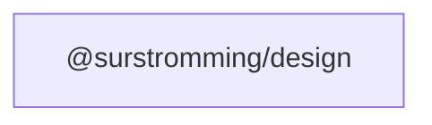

# @surstromming/design

Design values (colors, fonts, screens, spacing) exposed as SCSS getters, plus
the app-shell `layout()` mixin and the one CSS-emitting stylesheet, `reset.scss`.

## Dependency graph



## Usage

```scss
@use '@surstromming/design' as design;

.root {
  background-color: design.color(primary); // var(--primary, <light value>)
  padding: design.spacing(2);              // calc(var(--spacing, 0.25rem) * 2)
  font-family: design.font(sans);          // plain stack, not themable
  @include design.screen(md) { /* md and up */ }
}
```

An unknown token name fails the build. Theming overrides the custom
properties under `data-theme` on the root.

- `reset.scss` — modern reset; loads the font, puts `font`/`background`/
  `foreground` on `body`. The app imports it **once** in `main.ts`; component
  styles must never `@use` it (or anything CSS-emitting — every SFC style
  block compiles separately and would duplicate it).
- `layout($selector, $sidebarInset)` — `grid-template-areas` app shell over
  semantic direct children `aside` / `header` / `main` / `footer`. The footer
  is a full-width status bar row in both modes; any absent child collapses its
  track, so a shell without one is unchanged.
