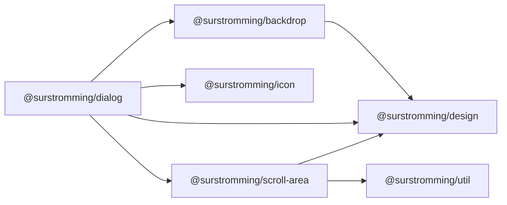

# @surstromming/dialog

A modal that takes over the screen until it's dealt with. Two modes on one
component:

- **`dialog`** (default) — a form, a detail view. An ✕, `Escape` and an outside
  click all close it.
- **`alertdialog`** — a decision that can't be waved away (delete, discard). No
  dismissal; the user must choose an action. This is shadcn's `AlertDialog`,
  folded in as a role rather than a second package.

## Dependency graph



## Usage

```vue
<template>
  <Button @click="open = true">Edit profile</Button>

  <Dialog v-model:open="open" title="Edit profile" description="Change your details.">
    <Input v-model="name" />
    <template #footer>
      <Button variant="outline" @click="open = false">Cancel</Button>
      <Button @click="save">Save</Button>
    </template>
  </Dialog>

  <!-- Confirmation that must be answered -->
  <Dialog v-model:open="confirm" role="alertdialog" title="Delete project?"
          description="This cannot be undone.">
    <template #footer>
      <Button variant="outline" @click="confirm = false">Cancel</Button>
      <Button variant="destructive" @click="remove">Delete</Button>
    </template>
  </Dialog>
</template>

<script setup lang="ts">
import { ref } from 'vue'
import { Dialog } from '@surstromming/dialog'
import { Button } from '@surstromming/button'
import { Input } from '@surstromming/input'
</script>
```

## Props

| Prop           | Type                     | Default              | Notes                                          |
| -------------- | ------------------------ | -------------------- | ---------------------------------------------- |
| `v-model:open` | `boolean`                | `false`              | The consumer owns the state                     |
| `title`        | `string`                 | —                    | Wires `aria-labelledby`                          |
| `description`  | `string`                 | —                    | Wires `aria-describedby`                         |
| `role`         | `dialog \| alertdialog`  | `dialog`             | `alertdialog` removes dismissal                  |

Dismissal follows `role` — a `dialog` closes on ✕/Escape/outside click; an
`alertdialog` has none of those (choose it deliberately, and give the footer a
Cancel). There's no `dismissible` override: an absent boolean prop is `false`,
not `undefined`, so it can't carry a role-dependent default without lying.

## Slots

| Slot      | Description                                              |
| --------- | ------------------------------------------------------- |
| `default` | The body.                                                |
| `header`  | Replaces the `title`/`description` pair.                  |
| `footer`  | Actions, right-aligned. **Required** for `alertdialog` — it's the only way out. |

## Surface

The panel paints `popover`, not `background`. They're the same white in light
mode, but in dark mode they differ (`0.205` vs `0.145`) — and a panel painted in
the page's own colour has nothing to stand out against, however much the scrim
dims what's behind it. Every other overlay here (`Popover`, `DropdownMenu`) is
already on that surface; the dialog just joins them.

## Anatomy

```
Backdrop                       // dim + blur, at `modal - 1`
div.overlay                    // fixed, centers the panel; outside-click target
  └─ div.panel[role]           // aria-modal, focus-trapped
       ├─ button.close         // ✕, dialog + dismissible only
       ├─ div.header           // title + description (or #header)
       ├─ div.body             // <slot />
       └─ div.footer           // #footer
```

## Behavior & accessibility

- **Focus trap** — opening moves focus to the first focusable inside (or the
  panel); `Tab`/`Shift+Tab` cycle within and can't escape. Closing returns
  focus to whatever was focused before, so the keyboard user lands back where
  they left.
- **Scroll lock** — `body` overflow is pinned while open and restored on close.
- `role` + `aria-modal="true"`, with `aria-labelledby`/`aria-describedby`
  wired from `title`/`description`.
- `alertdialog` ignores Escape and outside clicks by design — put a Cancel in
  the footer.

## Notes

- No animation-aware unmount beyond a fade+scale `Transition`; the panel
  unmounts when `open` is false.
- Scroll lock doesn't compensate for the scrollbar's width, so a page with a
  visible scrollbar can shift by a pixel or two on open. Fine for most apps;
  a `scrollbar-gutter` pass can come later if it matters.
