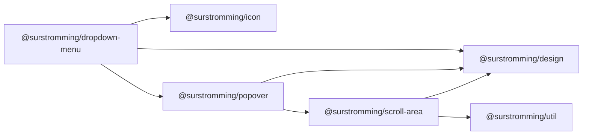

# @surstromming/dropdown-menu

A menu of actions anchored to a trigger — a row's "⋯", a user menu.
Data-driven: pass an array, wire a trigger, listen for `select`. Built on the
[`Popover`](../popover) shell (outside-click + Escape dismissal).

## Dependency graph



## Usage

```vue
<template>
  <DropdownMenu :items="items" @select="run">
    <template #trigger="{ toggle }">
      <Button variant="outline" @click="toggle">Options</Button>
    </template>
  </DropdownMenu>
</template>

<script setup lang="ts">
import { DropdownMenu, type DropdownMenuItem } from '@surstromming/dropdown-menu'
import { Button } from '@surstromming/button'
import { Pencil, Trash } from 'lucide'

const items: DropdownMenuItem[] = [
  { label: 'Edit', value: 'edit', icon: Pencil },
  { separator: true },
  { label: 'Delete', value: 'delete', icon: Trash, destructive: true },
]

const run = (value: string) => { /* value is 'edit' | 'delete' */ }
</script>
```

## Props

| Prop           | Type                 | Default      | Notes                                    |
| -------------- | -------------------- | ------------ | ---------------------------------------- |
| `items`        | `DropdownMenuItem[]` | — (required) | Options and separators, in order          |
| `align`        | `start \| end`       | `start`      | Which trigger edge the menu lines up with |
| `layer`        | `popover \| menu \| modal` | `popover` | From `Popover` — `menu` clears a teleported sidebar drawer |
| `v-model:open` | `boolean`            | `false`      | Optional — the trigger toggles it          |

```ts
type DropdownMenuItem =
  | { label: string; value: string; icon?: IconNode; disabled?: boolean; destructive?: boolean }
  | { separator: true }
```

| Emit     | Payload | When                          |
| -------- | ------- | ----------------------------- |
| `select` | `value` | An item is chosen (menu closes) |

## Slots

| Slot      | Props            | Description                                    |
| --------- | ---------------- | --------------------------------------------- |
| `trigger` | `{ open, toggle }` | The anchor. Call `toggle` to open/close.      |

The trigger is yours so it can be any control; add `aria-haspopup="menu"` and
`:aria-expanded="open"` to it for the full a11y contract.

## Anatomy

```
Popover
  ├─ <slot name="trigger" />
  └─ div.menu[role=menu]
       ├─ button.item[role=menuitem]   // icon + label; .isDestructive
       └─ div.separator[role=separator]
```

## Keyboard

| Key           | Action                                              |
| ------------- | --------------------------------------------------- |
| `↓` / `↑`     | Move between items (wraps, skips separators/disabled) |
| `Home` / `End`| First / last item                                    |
| `Enter` / `Space` | Fire the focused item (native button)            |
| `Escape`      | Close (from `Popover`)                               |
| `Tab`         | Close and move on — a menu isn't a tab stop          |
| outside click | Close (from `Popover`)                               |

Opening moves focus to the first item; closing returns focus to the trigger,
so a keyboard user never loses their place.

## Tokens

Panel from `Popover` (`popover`, `shadow(md)`). Items: `accent` highlight
shared by hover and focus; `destructive` items recolour text/icon and use a
`destructive` @ 10% highlight; separators are a `border` hairline.

## Notes

Actions only — no checkbox/radio items or submenus yet. For a value you keep
(a chosen option), that's [`Select`](../select), not a menu.
