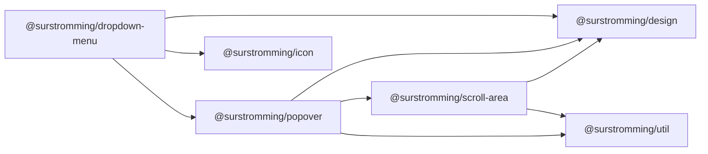

# @surstromming/dropdown-menu

A menu of actions anchored to a trigger — a row's "⋯", a user menu.
Data-driven: pass an array, wire a trigger, listen for `select`. Built on the
[`Popover`](../popover) shell (outside-click + Escape dismissal).

## Dependency graph



## Usage

```vue
<template>
  <DropdownMenu :items="items" @select="run">
    <template #trigger="{ toggle }">
      <Button variant="outline" @click="toggle">Options</Button>
    </template>
  </DropdownMenu>
</template>

<script setup lang="ts">
import { DropdownMenu, type DropdownMenuItem } from '@surstromming/dropdown-menu'
import { Button } from '@surstromming/button'
import { Pencil, Trash } from 'lucide'

const items: DropdownMenuItem[] = [
  { label: 'Edit', value: 'edit', icon: Pencil },
  { separator: true },
  { label: 'Delete', value: 'delete', icon: Trash, destructive: true },
]

const run = (value: string) => { /* value is 'edit' | 'delete' */ }
</script>
```

## Props

| Prop           | Type                 | Default      | Notes                                    |
| -------------- | -------------------- | ------------ | ---------------------------------------- |
| `items`        | `DropdownMenuItem[]` | — (required) | Options, submenus and separators, in order |
| `align`        | `start \| end`       | `start`      | Which trigger edge the menu lines up with |
| `side`         | `top \| right \| bottom \| left` | `bottom` | Which trigger edge the menu opens from |
| `layer`        | `popover \| menu \| modal` | `popover` | From `Popover` — `menu` clears a teleported sidebar drawer |
| `v-model:open` | `boolean`            | `false`      | Optional — the trigger toggles it          |

```ts
type DropdownMenuItem =
  | { label: string; value: string; icon?: IconNode; disabled?: boolean; destructive?: boolean }
  | { label: string; items: DropdownMenuItem[]; icon?: IconNode; disabled?: boolean }
  | { separator: true }
```

The middle shape is a **submenu** — a row that opens a menu of its own beside
it. It has `items` where an option has `value`, and that is the whole
difference: only a leaf can be chosen, so a row that could be selected *and*
opened would be one row meaning two things. `items` is the item type again, so
a submenu holds separators, and further submenus.

```ts
const items: DropdownMenuItem[] = [
  { label: 'Edit', value: 'edit', icon: Pencil },
  {
    label: 'Share',
    icon: Share2,
    items: [
      { label: 'Copy link', value: 'share-link' },
      { separator: true },
      { label: 'Email', value: 'share-email' },
    ],
  },
]
```

`select` fires with the leaf's `value` however deep it was, and the whole menu
closes.

| Emit     | Payload | When                          |
| -------- | ------- | ----------------------------- |
| `select` | `value` | An item is chosen (menu closes) |

## Slots

| Slot      | Props            | Description                                    |
| --------- | ---------------- | --------------------------------------------- |
| `trigger` | `{ open, toggle }` | The anchor. Call `toggle` to open/close.      |

The trigger is yours so it can be any control; add `aria-haspopup="menu"` and
`:aria-expanded="open"` to it for the full a11y contract.

## Anatomy

```
Popover
  ├─ <slot name="trigger" />
  └─ MenuPanel → div.menu[role=menu]
       ├─ button.item[role=menuitem]                     // icon + label; .isDestructive
       ├─ div.separator[role=separator]
       └─ Popover                                        // a submenu
            ├─ button.item[aria-haspopup=menu] + svg.caret
            └─ MenuPanel → div.menu[role=menu]           // … and so on down
```

`MenuPanel` is private and **recursive**: a submenu is another `Popover`, on
`side="right" align="start"`, holding another panel. Reusing the shell is what
keeps the second surface identical to the first — same border, same shadow,
same teleport out of whatever is scrolling — and it is why nothing here has a
depth limit.

## Keyboard

| Key           | Action                                              |
| ------------- | --------------------------------------------------- |
| `↓` / `↑`     | Move within the panel (wraps, skips separators/disabled) |
| `→`           | Open the focused submenu and step into it            |
| `←`           | Close this submenu, back to the row that opened it   |
| `Home` / `End`| First / last item of the panel                       |
| `Enter` / `Space` | Fire the focused item (native button)            |
| `Escape`      | Close the menu (from `Popover`)                       |
| `Tab`         | Close and move on — a menu isn't a tab stop          |
| outside click | Close (from `Popover`)                               |

`Escape` closes the **whole** menu rather than one level at a time: `Popover`
claims the key in the capture phase and the outermost one registered first, so
it answers first. `←` is the step-back-one key.

A submenu also opens on hover, and stays open for a moment after the pointer
leaves the row that opened it. The panel is off to the right, so reaching it
means crossing the rows underneath — and closing on the first of those is what
makes a flyout feel like it is running away.

Opening moves focus to the first item; closing returns focus to the trigger,
so a keyboard user never loses their place. A submenu opened by **pointer**
leaves focus where it is — it was a hover, not a request to go there; `→` is
what steps into one.

## Tokens

Panel from `Popover` (`popover`, `shadow(md)`). Items: `accent` highlight
shared by hover and focus; `destructive` items recolour text/icon and use a
`destructive` @ 10% highlight; separators are a `border` hairline.

## Notes

Actions only — no checkbox or radio items. For a value you keep (a chosen
option), that's [`Select`](../select), not a menu.

A submenu row is not selectable. Nothing stops a consumer nesting six deep, but
a menu that needs it is usually a dialog.
