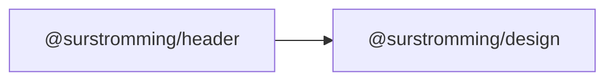

# @surstromming/header

App-shell header bar: a semantic `<header>` the design package's `layout()`
grid places in its `header` area. Content is whatever you slot in.

## Dependency graph



## Usage

```vue
<template>
  <Header>
    <Button variant="ghost" @click="toggle">…</Button>
  </Header>
</template>

<script setup lang="ts">
import { Header } from '@surstromming/header'
</script>
```

`class` / `@click` / `aria-*` fall through to the root `<header>`.

**Sticky by default** — `position: sticky; top: 0` (z-index 20, below overlays,
above page content). Its opaque `background` and bottom `border` keep scrolling
content from bleeding through. Override with a `class` if you want it static.
