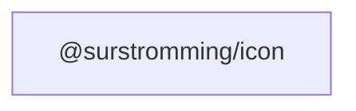

# @surstromming/icon

Renders any lucide icon as an inline SVG.

## Dependency graph



## Usage

Import icons from the `lucide` package and pass them to `Icon`:

```vue
<template>
  <Icon :icon="Search" :size="16" />
  <Icon :icon="Command" :size="20" :stroke-width="2.5" />
</template>

<script setup lang="ts">
import { Search, Command } from 'lucide'
import { Icon } from '@surstromming/icon'
</script>
```

`Icon` inherits colour via `currentColor`; `size` defaults to `1em` (scales with
the surrounding text). Pass a number for pixels, or size the `<svg>` from the
parent's CSS (e.g. `.btn svg { width: 1rem; height: 1rem; }`) for a fixed size.

See [`packages/CONVENTIONS.md`](../CONVENTIONS.md) for authoring rules.
