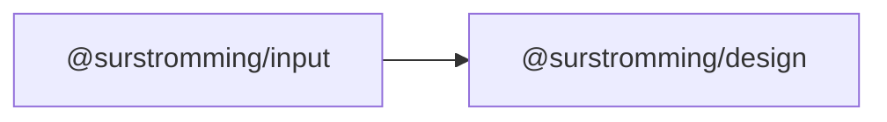

# @surstromming/input

Single-line text input. A native `<input>` with the design system's border,
focus ring, invalid and disabled states. Two-way bound with `v-model`.

## Dependency graph



## Usage

```vue
<template>
  <label for="email">Email</label>
  <Input id="email" v-model="email" type="email" placeholder="you@example.com" />
</template>

<script setup lang="ts">
import { ref } from 'vue'
import { Input } from '@surstromming/input'

const email = ref('')
</script>
```

## Props

| Prop            | Type                    | Default | Notes                                       |
| --------------- | ----------------------- | ------- | ------------------------------------------- |
| `v-model`       | `string \| number`      | —       | `defineModel()`; `.number`/`.trim` modifiers work |
| `type`          | `InputType`             | `text`  | See below                                    |
| `size`          | `sm \| md \| lg`        | `md`    | Heights match `Button` so they line up side by side |

```ts
export type InputType =
  | 'text' | 'email' | 'password' | 'search' | 'tel' | 'url'
  | 'number' | 'date' | 'time' | 'file'
```

Deliberately **not** props — these are native attributes and
[fall through](#fallthrough) to the `<input>`:

`placeholder` · `disabled` · `readonly` · `required` · `aria-invalid` ·
`autocomplete` · `name` · `id` · `min` / `max` / `step` · `accept` · `pattern`

A second source of truth for something the DOM already owns is a bug factory;
the CSS keys off the real attributes (`:disabled`, `[aria-invalid='true']`).

### Fallthrough

The root **is** the `<input>` — `class`, `@blur`, `@keydown`, `aria-*`, `data-*`
and every native attribute land on it (`inheritAttrs: true`). `@input` /
`@change` still fire; `v-model` rides on top of them.

## Anatomy

```
input.root                  // border, radius, typography, focus ring, invalid, disabled
  └─ .size-<size>           // height, padding
```

Base in `Input.vue`, sizes in `css/input-sizes.scss` — same split as `Button`:
partials compile first, so a property a size owns is declared in **every** size.

## Sizes

| Size | Height               | Padding (inline) | Pairs with            |
| ---- | -------------------- | ---------------- | --------------------- |
| `sm` | `spacing(8)` 2rem    | `spacing(3)`     | `<Button size="sm">`  |
| `md` | `spacing(9)` 2.25rem | `spacing(3)`     | `<Button size="md">`  |
| `lg` | `spacing(10)` 2.5rem | `spacing(4)`     | `<Button size="lg">`  |

Width is **100%** of the parent (`width: 100%; min-width: 0`) — inputs stretch
to their container, and the consumer sizes that container. `min-width: 0` keeps
a flex/grid parent from letting the input overflow its track.

## States & tokens

The component hardcodes no color; everything reads a `@surstromming/design`
token, and dark values are the `data-theme="dark"` overrides.

| State                        | Border               | Background                | Ring                             |
| ---------------------------- | -------------------- | ------------------------- | -------------------------------- |
| resting                      | `input`              | transparent (dark: `input` @ 30%) | —                        |
| `:focus-visible`             | `ring`               | unchanged                 | 3px `ring` @ 50%                  |
| `[aria-invalid='true']`      | `destructive`        | unchanged                 | 3px `destructive` @ 20% (dark: 40%) |
| `:disabled`                  | unchanged            | unchanged                 | — (opacity 50%, `cursor: not-allowed`) |

Also: `placeholder` text in `muted-foreground`; selected text in `primary` /
`primary-foreground`; `radius(md)`; `transition` on color and box-shadow only.

**Font size is `1rem` on mobile and `0.875rem` from `md` up** — anything under
16px makes iOS Safari zoom the viewport on focus. That's the one place this
component is deliberately mobile-first rather than uniform.

## Accessibility

- Every input needs a label. There is no built-in label slot — pair it
  explicitly, which keeps the `for`/`id` relationship visible at the call site:

  ```vue
  <label for="api-key">API key</label>
  <Input id="api-key" v-model="key" />
  ```

- Invalid state is `aria-invalid="true"` — it drives both the styling and the
  screen-reader announcement, so there is nothing to keep in sync. Point at the
  error text with `aria-describedby`:

  ```vue
  <Input id="email" v-model="email" :aria-invalid="!!error" aria-describedby="email-error" />
  <p v-if="error" id="email-error">{{ error }}</p>
  ```

- `disabled` removes the input from the tab order (native). Use `readonly`
  instead when the value must stay focusable and copyable.
- The focus ring uses `:focus-visible`, so it appears for keyboard focus but
  not on a mouse click.

## Recipes

```vue
<!-- Search with a trailing button -->
<div class="row">
  <Input v-model="query" type="search" placeholder="Search…" @keydown.enter="search" />
  <Button @click="search">Search</Button>
</div>

<!-- Number, coerced by the modifier -->
<Input v-model.number="quantity" type="number" min="1" step="1" />

<!-- File -->
<Input id="avatar" type="file" accept="image/*" @change="upload" />

<!-- Invalid + message -->
<Input v-model="email" :aria-invalid="!valid" aria-describedby="email-error" />
<p v-if="!valid" id="email-error">Enter a valid email.</p>
```

## Notes

- **No `label` / `error` / `hint` props.** Those belong to a future `Field`
  component (shadcn splits them out too) — an input that renders its own label
  can't be reused inside a field, a table cell, or an input group.
- `type="file"` styles the native file button minimally (transparent, inherits
  the font); a fully custom uploader is a different component.
- No `clearable`, no icons-inside-the-input: those are an `InputGroup`
  concern, not an input concern.
