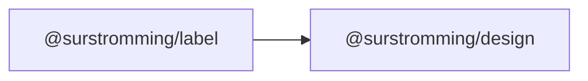

# @surstromming/label

Caption for a form control. A native `<label>` — clicking it focuses the
control it points at.

## Dependency graph



## Usage

```vue
<template>
  <Label for="email">Email</Label>
  <Input id="email" v-model="email" type="email" />
</template>

<script setup lang="ts">
import { Label } from '@surstromming/label'
import { Input } from '@surstromming/input'
</script>
```

## Props

| Prop       | Type      | Default | Notes                                                     |
| ---------- | --------- | ------- | --------------------------------------------------------- |
| `disabled` | `boolean` | `false` | Dims the label and blocks its clicks — mirror the control's own `disabled` |

`for` is **not** a prop: it's a native attribute and
[falls through](#fallthrough). shadcn dims its label from the input's state
with Tailwind's `peer-disabled:`, which needs a sibling selector we don't
have — so the disabled look is an explicit prop instead of hidden coupling.

### Slots

| Slot      | Description                                                     |
| --------- | ---------------------------------------------------------------- |
| `default` | The caption. Icons and a required marker fit inline (flex row).   |

### Fallthrough

The root **is** the `<label>` — `for`, `class`, `@click`, `data-*` land on it
(`inheritAttrs: true`).

## Anatomy

```
label.root    // flex row, gap, text-sm, medium, non-selectable
  └─ .isDisabled   // 50% opacity, no pointer events
```

## Tokens

Inherits its color (`foreground` via the reset) — no color of its own, so it
reads correctly inside any surface. `font-size: 0.875rem`, `font-weight: 500`,
`line-height: 1`, `gap: spacing(2)`, `user-select: none` (a double-click on a
caption should focus the field, not select the word).

## Accessibility

- `for` must match the control's `id`. That's what makes the label clickable
  and what a screen reader announces with the field — this is the whole point
  of the component.
- Wrapping the control instead of using `for` also works natively, but the
  explicit `for`/`id` pair survives refactors better.
- `disabled` is **presentational only** — it dims the caption; the control
  still needs its own `disabled`.

## Recipes

```vue
<!-- Required marker -->
<Label for="name">Name <span aria-hidden="true">*</span></Label>
<Input id="name" v-model="name" required />

<!-- Disabled field: both the control and its caption -->
<Label for="plan" disabled>Plan</Label>
<Input id="plan" v-model="plan" disabled />

<!-- Checkbox: caption sits beside the box -->
<Label for="terms"><input id="terms" v-model="agreed" type="checkbox" /> Accept terms</Label>
```
