# @surstromming/pagination

Page navigation: numbered buttons around the current page, ellipses for the
folded ranges, previous/next at the ends. Data-driven — pass `pageCount`,
bind `v-model`, done.

## Dependency graph

```mermaid
graph LR
  pagination["@surstromming/pagination"]
  button["@surstromming/button"]
  design["@surstromming/design"]
  icon["@surstromming/icon"]
  pagination --> button
  button --> design
  pagination --> design
  pagination --> icon
```



## Usage

```vue
<template>
  <Pagination v-model="page" :page-count="10" />
</template>

<script setup lang="ts">
import { ref } from 'vue'
import { Pagination } from '@surstromming/pagination'

const page = ref(1)
</script>
```

## Props

| Prop        | Type     | Default      | Notes                              |
| ----------- | -------- | ------------ | ---------------------------------- |
| `v-model`   | `number` | — (required) | Current page, **1-based**          |
| `pageCount` | `number` | — (required) | Total pages; `≤ 1` renders nothing |

No emits beyond the model update — the consumer reacts to `page` changing,
wherever the change came from.

## Windowing

The first and last page are always visible; the current page keeps one
neighbor on each side; each folded range is one ellipsis. Up to 7 slots total,
so the layout never jumps as the current page moves:

```
1 2 3 4 5 … 10          // current near the start
1 … 4 [5] 6 … 10        // current in the middle
1 … 6 7 8 9 10          // current near the end
```

With `pageCount ≤ 7` every page is shown, no ellipses.

## Anatomy

```
nav[aria-label=Pagination]
  └─ ul.list                  // flex row, spacing(1) gap
       ├─ li  Button ghost icon   // previous chevron, disabled on page 1
       ├─ li  Button ghost|outline icon  // a page; current is outline + aria-current
       ├─ li  span.ellipsis         // folded range, presentational
       └─ li  Button ghost icon   // next chevron, disabled on the last page
```

**Reuses `Button`** (`ghost` for pages and chevrons, `outline` for the current
page, all `size="icon"`) — pagination is exactly the styling Button already
has, unlike the sidebar rows that needed their own paint.

## Tokens

Everything comes from `Button`; the component adds only `spacing(1)` gaps and
the ellipsis box. Nothing hardcoded.

## Accessibility

- `<nav aria-label="Pagination">` around a real list.
- The current page is `aria-current="page"` — the outline variant is the
  visual, the attribute is the semantics.
- Chevron buttons are icon-only with `aria-label="Previous page"` /
  `"Next page"`; at the ends they render `disabled`.
- Ellipses are `aria-hidden` — they're a visual gap, not a control.

## Recipes

```vue
<!-- Derive pageCount from data -->
<Pagination v-model="page" :page-count="Math.ceil(total / pageSize)" />

<!-- Server-side: refetch on change -->
<Pagination v-model="page" :page-count="pageCount" />
watch(page, (p) => fetchRows(p))
```

## Notes

- Buttons only, no `href` mode in v1 — the SPA case is the model; a link mode
  (real URLs, middle-click) follows the SidebarGroup precedent if needed later.
- No `siblingCount` prop — one neighbor each side is the fixed policy until a
  real consumer needs more.
- The component clamps nothing: it disables what can't be clicked, and trusts
  `page` to be within range — the consumer owns the state.
