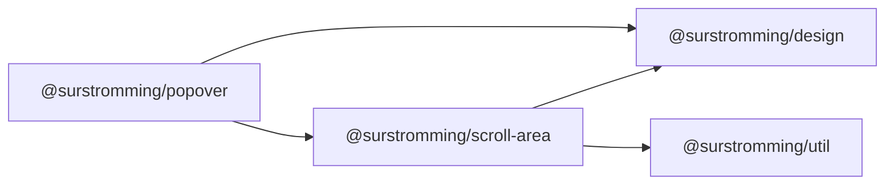

# @surstromming/popover

A panel anchored to a trigger. Closes on outside click and Escape. It owns
placement and dismissal — nothing else; what goes inside is yours.

The panel is teleported to `<body>` and positioned `fixed` from the trigger's
measured rect, so no ancestor's `overflow` can clip it — it opens correctly out
of a scroll container (a sidebar, a scrolling list). Placement re-measures on
scroll and resize, and the panel is **shifted to stay on screen** — it never
flips to the other side of its trigger.

The panel scrolls through a [`ScrollArea`](../scroll-area) rather than the
native scrollbar — not a prop, just what a panel is here.

Used by [`Select`](../select), [`Combobox`](../combobox) and
[`DropdownMenu`](../dropdown-menu).

## Dependency graph



## Usage

```vue
<template>
  <Popover v-model:open="open">
    <template #trigger>
      <Button @click="open = !open">Options</Button>
    </template>

    <p>Anything at all.</p>
  </Popover>
</template>

<script setup lang="ts">
import { ref } from 'vue'
import { Popover } from '@surstromming/popover'

const open = ref(false)
</script>
```

The trigger stays in the consumer's hands — the popover doesn't wrap it in a
button, so it works with a `Button`, an input, or a whole toolbar.

## Props

| Prop            | Type            | Default | Notes                                        |
| --------------- | --------------- | ------- | -------------------------------------------- |
| `v-model:open`  | `boolean`              | `false`  | The consumer owns the state                   |
| `side`          | `bottom \| right \| left` | `bottom` | Which side of the trigger it opens on      |
| `align`         | `start \| end`         | `start`  | Which edge, along `side`, the panel lines up with |
| `layer`         | `popover \| menu \| modal` | `popover` | Rung of the stacking ladder — a name, not a number |

### Slots

| Slot      | Description                                       |
| --------- | ------------------------------------------------- |
| `trigger` | The anchor. Toggle `open` from it yourself.        |
| `default` | Panel content.                                     |

## Anatomy

```
div.root            // measured for the trigger's rect (no positioning of its own)
  ├─ <slot name="trigger" />
  └─ <Teleport to="body">
       └─ div.panel // fixed, placed from the rect, scrolls past max-height
```

## Behavior

- **Outside click** closes it — on `mousedown`, not `click`, so a drag that
  starts inside the panel and ends outside (selecting text) doesn't dismiss it.
  "Inside" is the trigger *or* the teleported panel, since they're no longer
  nested.
- **Escape** closes it.
- Document listeners (dismiss, and the scroll/resize re-measure) are attached
  only while open.
- On `side: bottom` the panel is never narrower than the trigger (its width
  becomes the panel's `min-width`); it scrolls past `spacing(72)`.

## Notes

- **It shifts, it doesn't flip** — and only along the axis the *alignment* runs
  on. That's the axis the off-screen bug lives on: `align: end` on a trigger
  near the left edge otherwise puts the panel's left edge at `-63px`, with half
  the items unreachable. It's clamped to an 8px viewport margin.

  The **other** axis is deliberately not clamped: that one tracks the trigger.
  Clamping it pins the panel to the top of the screen while the thing it belongs
  to scrolls away underneath — it stops following, and floats over the header.

  A `Floating UI`-style *flip* is a different thing: a real dependency and a
  real API, and a menu that jumps to the other side of its trigger is more
  surprising than one that slides a few pixels. Not until something needs it.
- **The panel is clipped at the edges of the area its trigger is visible in**,
  so it slides *under* the app's chrome as you scroll instead of over it — the
  same thing a panel that wasn't teleported would do inside that scroll
  container. It's a `clip-path: inset(…)`, applied only when something actually
  needs cutting (the property makes a containing block; no reason to pay for one
  on every open popover).

  That area is the viewport narrowed by the trigger's scrolling ancestors —
  **each one only on the axis it actually scrolls**. The viewport alone isn't
  enough (a trigger sliding behind a sticky header is still inside it, so the
  panel floated over the header), but clipping on both axes is too much: the
  app shell's `main` scrolls vertically and its *left* edge is the sidebar, so
  a menu that opens leftward got cut off at the sidebar. Cutting only where a
  container scrolls gives both — the panel slides under the header, and a menu
  still escapes sideways over the sidebar, which is the whole reason the panel
  is teleported in the first place.

  On scroll the new position is written **straight to the element**, not left
  to Vue's next render tick — a tick late reads as the panel lagging a frame
  behind and snapping back. One frame of lag does remain and can't be removed
  here: scroll events fire *after* the browser has painted the scroll, so any
  JS-positioned element trails it. Only CSS anchor positioning (`anchor-name` /
  `position-anchor`) fixes that properly, and it isn't in every browser yet.

  Clipping rather than hiding is deliberate — a panel that blinks out of
  existence mid-scroll reads as a glitch, one that slides behind the header
  reads as depth. The chain of clipping ancestors is collected once on open and
  only their *rects* are re-read per scroll: `getComputedStyle` is too heavy to
  call on every frame of one.

  Clamping needs the panel's own size, since `align: end` and `side: left` are
  expressed as a right/bottom edge that only becomes a left/top once you know
  how wide the thing is. It's measured on open inside `nextTick` — which lands
  before paint, so the clamped position is the first one drawn, not a correction
  after it — and kept fresh by a `ResizeObserver` for panels whose content
  changes (a combobox list being filtered).

  All of that lives in `src/composables/useAnchoredPosition.ts`; the component
  itself is left with dismissal and the template.
- No focus trap. It's a menu/listbox anchor, not a modal — Escape and outside
  click are the escape hatches.
