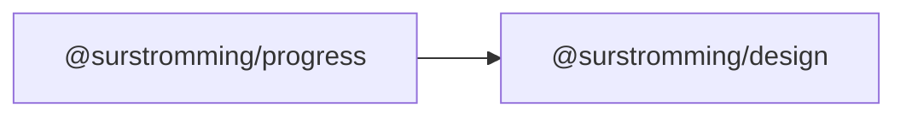

# @surstromming/progress

Progress bar — a task with a known completion (an upload, a multi-step form).
For "something is happening, duration unknown", use [`Spinner`](../spinner).

## Dependency graph



## Usage

```vue
<template>
  <Progress :value="uploaded" />
  <Progress :value="step" :max="4" />
</template>

<script setup lang="ts">
import { Progress } from '@surstromming/progress'
</script>
```

## Props

| Prop    | Type     | Default | Notes                    |
| ------- | -------- | ------- | ------------------------ |
| `value` | `number` | `0`     | Clamped to `0…max`        |
| `max`   | `number` | `100`   |                          |

Read-only — no `v-model`: progress is reported *to* the user, never edited by
them.

## Anatomy

```
div.root[role=progressbar]   // track, clips the bar
  └─ div.bar                 // full width, translated left by the remainder
```

The bar is full-width and **translated** rather than width-animated: transforms
run on the compositor, so a fast-ticking upload doesn't trigger layout on every
frame.

## Tokens

Track `muted`, bar `primary`, pill radius, height `spacing(2)`. The transition
honours `prefers-reduced-motion`.

## Accessibility

`role="progressbar"` with `aria-valuenow` / `valuemin` / `valuemax`. Give it an
accessible name — `aria-label`, or `aria-labelledby` pointing at your caption
(both fall through).
