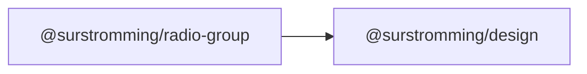

# @surstromming/radio-group

Pick exactly one of several options. Data-driven: pass an array, get the group
— native `<input type="radio">`s under a drawn circle, so arrow-key navigation
and form submission are the browser's.

## Dependency graph



## Usage

```vue
<template>
  <RadioGroup v-model="plan" :options="plans" />
</template>

<script setup lang="ts">
import { ref } from 'vue'
import { RadioGroup, type RadioOption } from '@surstromming/radio-group'

const plan = ref('pro')
const plans: RadioOption[] = [
  { label: 'Free', value: 'free' },
  { label: 'Pro', value: 'pro' },
  { label: 'Enterprise', value: 'enterprise', disabled: true },
]
</script>
```

## Props

| Prop          | Type                       | Default    | Notes                                              |
| ------------- | -------------------------- | ---------- | -------------------------------------------------- |
| `v-model`     | `string`                   | —          | The selected `value`                                |
| `options`     | `RadioOption[]`            | — (required) | `{ label, value, disabled? }`                     |
| `orientation` | `vertical \| horizontal`   | `vertical` | Horizontal wraps                                    |
| `name`        | `string`                   | auto (`useId()`) | Only needed when two groups share one form    |

```ts
export interface RadioOption {
  label: string
  value: string
  disabled?: boolean
}
```

## Anatomy

```
div.root[role=radiogroup]
  └─ label.option              // per option: circle + caption, clickable
       ├─ input.input          // the real radio: invisible, on top
       └─ span.circle > span.dot
```

## States & tokens

| State            | Circle        | Dot                |
| ---------------- | ------------- | ------------------ |
| resting          | `input`       | hidden (`scale(0)`) |
| `:checked`       | `primary`     | `primary`, scales in |
| `:focus-visible` | `ring` + 3px ring | —              |
| disabled option  | 50% opacity   | —                  |

## Accessibility

- Real radios sharing one `name`: ↑/↓ move between options, and only one can be
  selected — all native.
- Each option is wrapped in its own `<label>`, so the caption is clickable
  without any `for`/`id` wiring.
- The group needs its own caption — put a `<Label>` or a `<legend>` above it
  and point at it with `aria-labelledby`.
