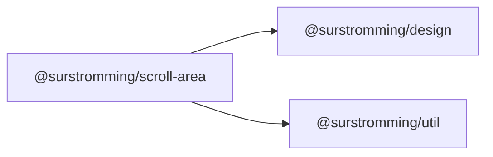

# @surstromming/scroll-area

A scroll container that hides the native scrollbar and paints its own: a step
arrow at each end, a draggable thumb, and a track you can page on.

It behaves like a browser's, not like a phone's overlay bar — **present whenever
there's something to scroll, and then it stays**. When the content fits, there's
no bar and no gutter: the space comes back.

`autoHide` swaps that for the overlay behaviour — the bar floats over the
content and fades out when idle, appearing on hover, drag or scroll.

Only the *painting* is ours. The element is a real scroll container, so the
wheel, trackpad, keyboard, `scrollIntoView` and anchor links keep working
untouched.

Vertical only — a horizontal bar would double every measurement for a case this
library doesn't have yet.

## Dependency graph



## Usage

The component brings no height of its own — give it one (or a `max-height`) and
it scrolls what overflows.

```vue
<template>
  <ScrollArea :class="$style.box">
    <p v-for="line in lines" :key="line">{{ line }}</p>
  </ScrollArea>
</template>

<script setup lang="ts">
import { ScrollArea } from '@surstromming/scroll-area'

const lines = Array.from({ length: 60 }, (_, index) => `Line ${index + 1}`)
</script>

<style module lang="scss">
.box {
  height: 240px;
}
</style>
```

## Props

| Prop       | Type      | Default | Notes                                                |
| ---------- | --------- | ------- | ---------------------------------------------------- |
| `as`       | `string`  | `'div'` | Root element — `main` makes the page the scroller    |
| `autoHide` | `boolean` | `false` | Float over the content and fade out when idle         |

`autoHide` also drops the gutter — a bar that comes and goes can't reserve
space without the layout jumping — and gives the bar a `background` wash at 85%,
since it now paints over whatever it covers.

### Slots

| Slot      | Description                  |
| --------- | ---------------------------- |
| `default` | The content that scrolls.    |

### Fallthrough

`class`, `style` and listeners land on the root — that's where you set the
height. The scrolling element is a private inner `div`.

## Where it's used

The app's pages are `<ScrollArea as="main">`, so the whole shell scrolls through
it rather than the browser's bar (the `.page` styles move to an inner `div`, so
padding and `max-width` stay *inside* the scroller).

Three components scroll through it too — always, not behind a prop. A boolean
every consumer would set to `true` is noise, and one scrollbar everywhere is the
point of having one. **Only the consumer's content is wrapped**, never their
chrome:

| Component               | What scrolls                                        |
| ----------------------- | --------------------------------------------------- |
| [`Popover`](../popover) | The panel — so `Select`, `Combobox`, `DropdownMenu` and `DatePicker` inherit it |
| [`Sidebar`](../sidebar) | The nav column                                       |
| [`Dialog`](../dialog)   | The body; header, ✕ and footer stay put              |

Each turns its own `overflow` off and becomes a flex column, so `max-height`
still bounds the ScrollArea inside it.

The escape hatch isn't a prop either: under **`forced-colors`** (Windows high
contrast) the painted bar hides itself and the native one comes back. Forced
colors replaces the tokens the bar is drawn from, and the OS scrollbar is what
the user asked for — so that decision lives here, once, instead of at every call
site.

## Anatomy

```
root (relative, overflow hidden)   ← your height goes here
├── viewport (overflow-y auto, native bar hidden)
│   └── slot          padding-right clears the bar while it's there
└── bar (absolute, in the gutter the viewport reserves for it)
    ├── arrow ▲   press and hold to repeat
    ├── track     click above/below the thumb to page
    │   └── thumb drag to scroll
    └── arrow ▼
```

The bar is drawn from four measured numbers — `scrollTop`, viewport height,
content height, track height. A `ResizeObserver` watches the viewport *and* its
first child, so content that grows re-sizes the thumb.

## Tokens

| Part  | Token                                            |
| ----- | ------------------------------------------------ |
| caret | `muted-foreground` → `foreground` on hover       |
| thumb | `foreground` at 45% / 60% hover / 75% dragging   |

Parked, the bar itself paints nothing — no track fill, no wash. It sits in a
gutter the viewport reserves for it, so whatever surface it's on shows through
and it reads correctly in the sidebar, a popover and a dialog alike. Only
`autoHide` adds the wash, because only then does it cover content.

The carets are a 12×9 inline `<svg>` triangle, not an icon: a stroked lucide
chevron reads as a link affordance at this size and there's no solid caret in
the set, so the package doesn't depend on `@surstromming/icon`. The corners are
rounded by stroking the path in its own colour with `stroke-linejoin: round` —
which is also why that colour is opaque, since fill and stroke overlap and a
translucent one would draw a darker rim along the edge.

## Behaviour

| Gesture                     | Result                                  |
| --------------------------- | --------------------------------------- |
| Arrow click                 | 40px; press and hold repeats            |
| Track click                 | One viewport towards the click, smooth  |
| Thumb drag                  | Proportional, grabbed where you clicked |
| Wheel / keyboard / trackpad | Native, untouched                       |

## Accessibility

The bar is `aria-hidden` and its arrows are `tabindex="-1"`: it duplicates
scrolling that the viewport already offers to the keyboard, so exposing it twice
would only add noise. Screen readers and keyboard users get the native
behaviour.
