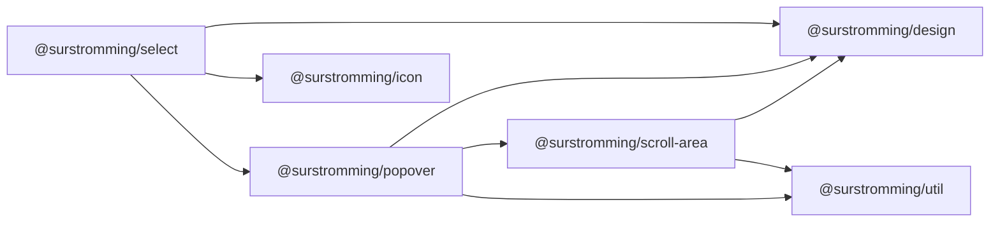

# @surstromming/select

Pick one option from a list. Data-driven: pass an array of options, get the
whole control — a styled trigger plus a listbox in a [`Popover`](../popover).

## Dependency graph



## Usage

```vue
<template>
  <Label id="fruit-label">Fruit</Label>
  <Select v-model="fruit" :options="fruits" aria-labelledby="fruit-label" />
</template>

<script setup lang="ts">
import { ref } from 'vue'
import { Select, type SelectOption } from '@surstromming/select'

const fruit = ref('')
const fruits: SelectOption[] = [
  { label: 'Apple', value: 'apple' },
  { label: 'Banana', value: 'banana' },
  { label: 'Durian', value: 'durian', disabled: true },
]
</script>
```

## Props

| Prop          | Type              | Default     | Notes                                  |
| ------------- | ----------------- | ----------- | -------------------------------------- |
| `v-model`     | `string`          | —           | The selected `value`                    |
| `options`     | `SelectOption[]`  | — (required) | `{ label, value, disabled? }`          |
| `placeholder` | `string`          | `Select…`   | Shown, dimmed, until something is picked |
| `size`        | `sm \| md \| lg`  | `md`        | Heights match `Input` and `Button`      |
| `disabled`    | `boolean`         | `false`     |                                         |
| `layer`       | `popover \| menu \| modal` | `popover` | Rung of the stacking ladder — see below |
| `side`        | `top \| bottom \| right \| left` | `bottom` | Which side the list opens on — see below |

`side` is forwarded to [`Popover`](../popover) too, and it exists for one common
place `bottom` is wrong: a Select near the **foot of the screen** — a composer,
a bottom toolbar — opens its list into nothing and the options are clipped by
the viewport. Popover places the panel where it is told and never flips, so
`side="top"` is the fix rather than a heuristic; a component cannot know how
much room is under it, and guessing from the DOM would be a lie the one time it
guessed wrong.

`layer` is forwarded to [`Popover`](../popover). `popover` (30) is right almost
everywhere; a Select **inside a [`Dialog`](../dialog)** needs `modal`, or the
list is drawn at 30 while the dialog sits at 70 and the options open behind it.

`id` · `aria-*` fall through **to the trigger button** (`inheritAttrs: false`)
— it's the focusable control.

## Anatomy

```
Popover
  ├─ button.trigger    // value + chevron; the focusable control
  └─ ul.list[role=listbox]
       └─ li.option[role=option]   // .isActive highlight, check on the selected one
```

## Keyboard

| Key           | Action                                              |
| ------------- | --------------------------------------------------- |
| `↓` / `↑`     | Open; then move the active option (skips disabled)   |
| `Enter` / `Space` | Open; then pick the active option                |
| `Escape`      | Close (from `Popover`)                               |
| outside click | Close (from `Popover`)                               |

Opening highlights the **current** selection, so `↓` moves from where you are.
Focus stays on the trigger the whole time — nothing to restore on close.

## Tokens

Trigger mirrors [`Input`](../input): `input` border, `radius(md)`, `ring` focus
ring, `destructive` when `aria-invalid`, dark `input` @ 30% background. Panel
uses `popover` / `border`; the active option uses `accent`.

## Notes

- Not a native `<select>`: the native one can't be styled to match (its dropdown
  is drawn by the OS), which is the entire reason this component exists. The
  trade-off is that we own the keyboard behaviour — see the table above.
- Single-select only. Multi-select needs chips, a different value type, and a
  different keyboard model.
- Need to filter a long list? That's [`Combobox`](../combobox).
