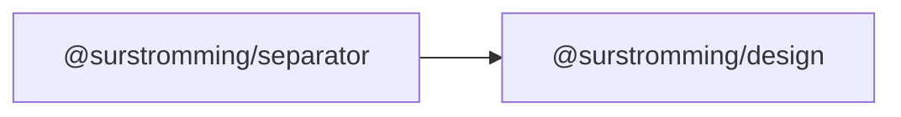

# @surstromming/separator

A thin rule between content — a line across a menu, a divider between toolbar
groups.

## Dependency graph



## Usage

```vue
<template>
  <p>Above</p>
  <Separator />
  <p>Below</p>

  <div style="display: flex; height: 1.5rem">
    <span>Left</span>
    <Separator orientation="vertical" />
    <span>Right</span>
  </div>
</template>

<script setup lang="ts">
import { Separator } from '@surstromming/separator'
</script>
```

## Props

| Prop          | Type                       | Default      | Notes                                        |
| ------------- | -------------------------- | ------------ | -------------------------------------------- |
| `orientation` | `horizontal \| vertical`   | `horizontal` | Vertical needs a parent with a set cross-size |
| `decorative`  | `boolean`                  | `true`       | `false` marks a real semantic divide          |

## Tokens

`border`, 1px. A vertical separator uses `align-self: stretch`, so it fills the
height of the flex row it sits in.

## Accessibility

Decorative by default — a rule drawn purely for looks announces nothing. Set
`decorative="false"` when the line marks a genuine grouping boundary; it then
becomes `role="separator"` with the right `aria-orientation`.
