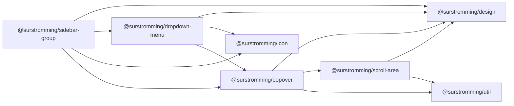

# @surstromming/sidebar-group

A labelled section of sidebar navigation, rendered from data. One group is a
title plus a menu; each menu item is an icon, a label, and — optionally — a
**submenu**: either nested nav links that collapse in place, or a `…` dropdown
of actions for that item.

Drop groups into a `<Sidebar>`; the group knows nothing about the sidebar's
open/closed state.

## Dependency graph



## Usage

```vue
<template>
  <Sidebar v-model:open="sidebar.open">
    <SidebarGroup label="Platform" :items="platform" @select="go" @toggle="toggleSection" />
    <SidebarGroup label="Projects" :items="projects" @select="go" @action="onAction" />
  </Sidebar>
</template>

<script setup lang="ts">
import { computed, ref } from 'vue'
import { Sidebar } from '@surstromming/sidebar'
import { SidebarGroup } from '@surstromming/sidebar-group'
import type { SidebarGroupItem } from '@surstromming/sidebar-group'
import { Bot, Frame, SquareTerminal, Folder, Trash2 } from 'lucide'
import { useRoute, useRouter } from 'vue-router'

const router = useRouter()
const route = useRoute()
const go = (value: string) => router.push(value)
const onAction = (item: string, action: string) => console.log(item, action)

// The app owns both `active` (derived from the route) and `expanded`.
const openSection = ref<string | null>('/playground')
const toggleSection = (value: string) => {
  openSection.value = openSection.value === value ? null : value
}

// Nested nav: submenu.type 'items'
const platform = computed<SidebarGroupItem[]>(() => [
  {
    label: 'Playground',
    value: '/playground',
    icon: SquareTerminal,
    active: route.path.startsWith('/playground'),
    expanded: openSection.value === '/playground',
    submenu: {
      type: 'items',
      entries: [
        { label: 'History', value: '/playground/history' },
        { label: 'Starred', value: '/playground/starred', active: route.path === '/playground/starred' },
      ],
    },
  },
  { label: 'Models', value: '/models', icon: Bot },
])

// Per-item action menu: submenu.type 'menu'
const projects: SidebarGroupItem[] = [
  {
    label: 'Design Engineering',
    value: '/projects/design',
    icon: Frame,
    submenu: {
      type: 'menu',
      entries: [
        { label: 'View project', value: 'view', icon: Folder },
        { separator: true },
        { label: 'Delete', value: 'delete', icon: Trash2, destructive: true },
      ],
    },
  },
]
</script>
```

## Props

| Prop             | Type                | Default | Notes                                                   |
| ---------------- | ------------------- | ------- | ------------------------------------------------------- |
| `label`          | `string`            | —       | Group title. Omit for an unlabelled group.              |
| `items`          | `SidebarGroupItem[]` | —      | Required.                                               |
| `side`           | `left \| right`     | `left`  | Where the *sidebar* is; the action menu opens opposite. |
| `layer`          | `popover \| menu \| modal` | `menu` | Stacking for the (teleported) action menu. |

### Item

| Field     | Type                 | Notes                                                        |
| --------- | -------------------- | ------------------------------------------------------------ |
| `label`   | `string`             | Visible text.                                                 |
| `value`   | `string`             | Identity; what `select` emits. A route path reads well.       |
| `href`    | `string`             | Renders the row as a real `<a>` — see below. Absent → `<button>`. |
| `icon`    | `IconNode`           | A lucide icon (`import { Bot } from 'lucide'`).               |
| `active`  | `boolean`            | Paints the current page's row. The app owns "current".         |
| `expanded` | `boolean`           | Opens the nested list. The app owns it — see below.            |
| `submenu` | `SidebarGroupSubmenu` | See below. Absent → a plain row.                             |

### Rows, links, and clicks

A row with `href` is an `<a href>`; without one it's a `<button>`. The element
is picked by a `computed` returning `{ is, props }`, so the row's children are
written once.

`href` exists for the behaviors only a genuine link has: middle-click and
Cmd/Ctrl+click open a new tab, the context menu offers "Open in new tab", the
browser previews the URL on hover. Faking those on a `<button>` with `auxclick`
+ `window.open` gets one of them right and lies about the rest, so it isn't done.

Plain left clicks are still intercepted (`preventDefault`) and emitted as
`select`, leaving navigation to the app's router; modified clicks fall through
to the browser untouched, and middle-click never reaches the handler at all
(it fires `auxclick`, not `click`). This is `RouterLink`'s contract. The
consequence to know: **an item with `href` whose `select` nobody handles does
nothing on a plain click** — the href only carries modified clicks.

### Submenu

Nested links and an action menu both hang off an item's trailing control, so
they can't coexist — the data names which one it is:

```ts
export type SidebarGroupSubmenu =
  | { type: 'items'; entries: SidebarGroupSubItem[] } // collapsible nested nav
  | { type: 'menu'; entries: DropdownMenuItem[] }     // '…' dropdown of actions
```

`type: 'items'` renders a chevron that expands `entries` beneath the row
(`{ label, value, active? }` — same `select` emit as a top-level item).
`type: 'menu'` renders a `…` trigger — appearing on hover or keyboard focus —
that opens a `DropdownMenu` built from `entries`
(`@surstromming/dropdown-menu`'s own item type, separators and `destructive`
included). The menu teleports to `<body>` and opens on the side away from the
sidebar (`side` flips it), so a sidebar's `overflow` never clips it.

## Emits

| Event    | Payload                          | Fired when                                          |
| -------- | -------------------------------- | --------------------------------------------------- |
| `select` | `value: string`                  | An item or sub-item row is plain-clicked.           |
| `action` | `item: string, action: string`   | A dropdown entry is chosen; `item` is whose menu.   |
| `toggle` | `value: string`                  | The chevron is clicked; flip that item's `expanded`. |

The component emits and the app decides (`router.push`, a store call, anything)
— the package never navigates and never imports a router.

## Fallthrough

Single root (`<div>`), default `inheritAttrs` — `class`, `aria-*` and listeners
land on the group. The action menu is teleported to `<body>`, so it's stacked
by `layer` (default `menu`) — above the sidebar's own rung, since on mobile the
drawer is teleported too and a lower menu would render *behind* it.

## Anatomy

```
div.root                        the group
├── div.label                   `label` (omitted when unset)
└── ul.menu
    └── li.item
        ├── a|button .button    icon + label (`href` picks) → select
        ├── button.action       chevron, type 'items'       → toggle
        ├── DropdownMenu        '…', type 'menu'            → action
        └── div.sub             collapse wrapper (0fr → 1fr)
            └── ul > li > button.subButton                  → select
```

Nested rows collapse with `grid-template-rows: 0fr → 1fr` plus `overflow:
hidden` (Accordion's trick) — real height, no JS measuring.

## Expanded state

`expanded` is item data, like `active` — the component is fully controlled and
holds no open/closed state of its own. The chevron emits `toggle(value)`; the
app flips the flag (usually in the same `computed` that derives `active`).
Nothing auto-opens from `active` either — that's the app's call too.

Policy lives where the state does. One-section-at-a-time isn't a prop, it's
the app holding a single value:

```ts
const openSection = ref<string | null>('playground')
const toggleSection = (value: string) => {
  openSection.value = openSection.value === value ? null : value
}
// in the items computed:  expanded: openSection.value === 'playground'
```

Several-at-once is the same handler over a `string[]` instead.

## Tokens

`sidebar-foreground` (label at 70% via `with-alpha`, rows at full), `sidebar-accent`
/ `sidebar-accent-foreground` (hover and the `active` row), `sidebar-border` (the
nested list's leading rule), `sidebar-ring` (focus). Spacing and radii come from
`design.spacing()` / `design.radius()`.

## Accessibility

The menu is a `<ul>` of `<li>`s; every row is a real `<button>` or `<a href>`,
so Tab, Enter and the link affordances are the browser's. The chevron carries `aria-expanded` and controls the
nested list; an `active` row gets `aria-current="page"`. The `…` trigger is
labelled `aria-label="More"`.

## Recipes

**Flat group, no submenus** — pass items without `submenu` (shadcn's
`nav-secondary`).

**Push a group to the bottom** — `class` falls through:
`<SidebarGroup class="mt-auto" …>`, or `margin-block-start: auto` in the app.
