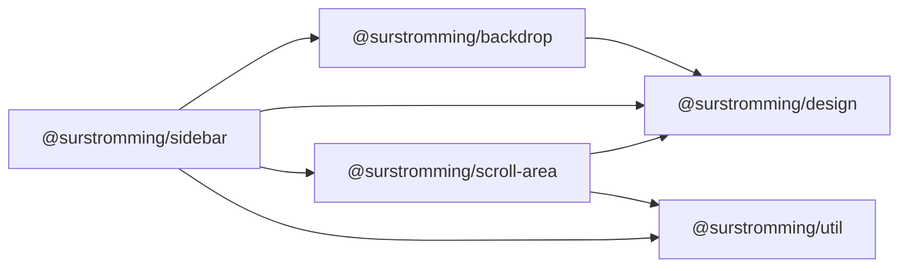

# @surstromming/sidebar

Responsive sidebar, one component: a collapsible in-flow panel on desktop, an
off-canvas drawer over a backdrop on mobile (teleported to `<body>`). Content
is whatever you slot in. Crossing the breakpoint reparents the same `<aside>`,
so nothing animates on resize.

## Dependency graph



## Usage

Presentational: `v-model:open` + `side`. The app owns the state — the demo
holds it in a Pinia store (`src/stores/sidebar.ts`) so the header trigger and
the page's sidebar share one `open`, which defaults per mode (desktop shown,
mobile hidden) and resets when the viewport crosses the breakpoint.

```vue
<template>
  <Sidebar v-model:open="sidebar.open">…content…</Sidebar>
</template>

<script setup lang="ts">
import { Sidebar } from '@surstromming/sidebar'
import { useSidebar } from '@/stores/sidebar'

const sidebar = useSidebar()
</script>
```

**Props** — `side`: `left | right` (default `left`) · `v-model:open`: `boolean` ·
The drawer sits on the `sidebar` rung of the stacking ladder and its backdrop
one step under it — both declared in SCSS, so there's no stacking prop.

The nav column scrolls through a [`ScrollArea`](../scroll-area) — the overlay
bar, not the native one.

**Width** — a build-time Sass constant, `$sidebar-width` in
`src/css/sidebar-config.scss` (`design.spacing(64)` → `16rem`), shared by the
partials. Fork the package to change it — it isn't a runtime knob.
