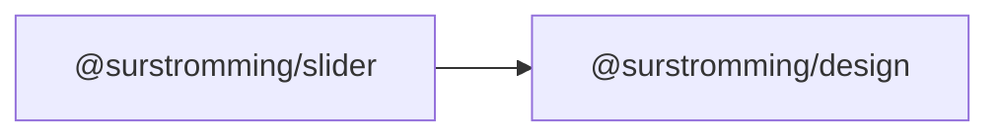

# @surstromming/slider

Pick a number from a range. A native `<input type="range">` with a painted
track and thumb — arrow keys, Home/End, drag and touch all come free.

## Dependency graph



## Usage

```vue
<template>
  <Label for="volume">Volume — {{ volume }}%</Label>
  <Slider id="volume" v-model="volume" :max="100" :step="5" />
</template>

<script setup lang="ts">
import { ref } from 'vue'
import { Slider } from '@surstromming/slider'

const volume = ref(40)
</script>
```

## Props

| Prop      | Type     | Default | Notes                        |
| --------- | -------- | ------- | ---------------------------- |
| `v-model` | `number` | `0`     | Always a number, never a string |
| `min`     | `number` | `0`     |                              |
| `max`     | `number` | `100`   |                              |
| `step`    | `number` | `1`     |                              |

`id` · `disabled` · `aria-*` fall through to the `<input>`.

The model reads `valueAsNumber`, so `v-model` gives you a real number without
a `.number` modifier.

## Anatomy

```
input.root[type=range]     // track painted with a gradient
  ├─ ::-webkit-slider-thumb
  └─ ::-moz-range-thumb
```

The filled portion is a `linear-gradient` whose stop is the current
percentage, bound with `v-bind(fill)` — a component's own state is the one
legitimate use of `v-bind()` in a style block.

## Tokens

Filled track `primary`, rest `muted`, thumb `background` with a `primary`
border, 3px `ring` @ 50% on `:focus-visible`. Track `spacing(1.5)`, thumb
`spacing(4)`.

## Accessibility

Native range input: ←/→ step, ↑/↓ step, Home/End jump to the ends, and the
value is announced. Label it, and put the current value in the label (as
above) — a slider that only shows its value visually says nothing to a screen
reader user mid-drag.

## Notes

Single value only. A two-thumb range needs two inputs and overlap handling —
a different component.
