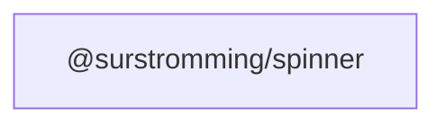

# @surstromming/spinner

Spinning loading indicator.

## Dependency graph



## Usage

```vue
<template>
  <Button disabled>
    <Spinner />
    Saving…
  </Button>
  <Spinner :size="32" />
</template>

<script setup lang="ts">
import { Spinner } from '@surstromming/spinner'
import { Button } from '@surstromming/button'
</script>
```

Inherits colour via `currentColor`. `size` defaults to `1em` (scales with the
surrounding text); pass a number for pixels. Respects `prefers-reduced-motion`.
