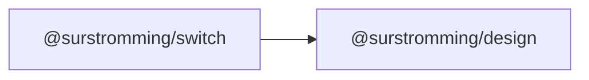

# @surstromming/switch

On/off switch — an immediate toggle (a setting that applies at once), unlike a
[`Checkbox`](../checkbox), which is a value you submit with a form.

A native `<input type="checkbox" role="switch">` made invisible on top of a
drawn track, so keyboard, click and forms stay native.

## Dependency graph



## Usage

```vue
<template>
  <Label for="airplane">
    <Switch id="airplane" v-model="airplaneMode" /> Airplane mode
  </Label>
</template>

<script setup lang="ts">
import { ref } from 'vue'
import { Switch } from '@surstromming/switch'

const airplaneMode = ref(false)
</script>
```

## Props

| Prop      | Type      | Default | Notes           |
| --------- | --------- | ------- | --------------- |
| `v-model` | `boolean` | —       | `defineModel()` |

`id` · `disabled` · `name` · `aria-*` and everything else **fall through to the
inner `<input>`** (`inheritAttrs: false`) — that's where a `Label`'s `for` must
point.

## Anatomy

```
span.root          // 2rem × 1.25rem, positioning context
  ├─ input.input   // the real checkbox (role="switch"): invisible, on top
  └─ span.track    // painted track
       └─ span.thumb   // slides on :checked
```

## States & tokens

| State            | Track       | Thumb        |
| ---------------- | ----------- | ------------ |
| resting          | `input`     | `background` |
| `:checked`       | `primary`   | slides right |
| `:focus-visible` | `ring` border + 3px ring | — |
| `:disabled`      | 50% opacity | —            |

Pill radius; the thumb's slide honours `prefers-reduced-motion`.

## Accessibility

`role="switch"` on a real checkbox: Space toggles it and screen readers
announce "on"/"off" instead of "checked". Label it — a lone switch says
nothing about what it turns on.
