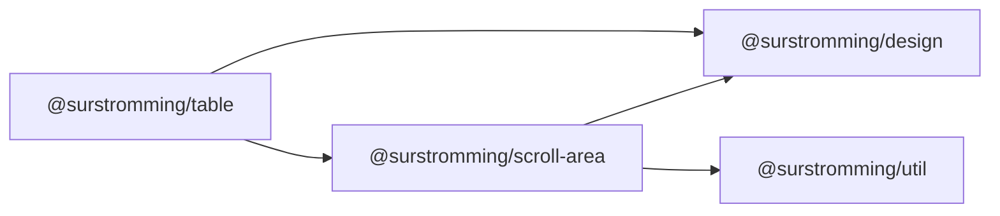

# @surstromming/table

A styled semantic `<table>`, data-driven: pass `columns` and `rows`, get the
table. Presentational only — sorting, selection and pagination live in
`DataTable` (later), which composes this.

## Dependency graph



## Usage

```vue
<template>
  <Table :columns="columns" :rows="invoices" caption="A list of your recent invoices.">
    <template #cell-amount="{ value }">
      <strong>{{ value }}</strong>
    </template>
  </Table>
</template>

<script setup lang="ts">
import { Table, type TableColumn } from '@surstromming/table'

const columns: TableColumn[] = [
  { key: 'invoice', header: 'Invoice' },
  { key: 'status', header: 'Status' },
  { key: 'amount', header: 'Amount', align: 'right' },
]

const invoices = [
  { invoice: 'INV001', status: 'Paid', amount: '$250.00' },
  { invoice: 'INV002', status: 'Pending', amount: '$150.00' },
]
</script>
```

## Props

| Prop      | Type            | Default      | Notes                                             |
| --------- | --------------- | ------------ | ------------------------------------------------- |
| `columns` | `TableColumn[]` | — (required) | `{ key, header, align? }`                         |
| `rows`    | `TableRow[]`    | — (required) | Records; a cell shows `row[column.key]` as text   |
| `rowKey`  | `string`        | — (index)    | Column key with unique values, used for `v-for` keys |
| `caption` | `string`        | —            | Rendered as `<caption>`, below the table          |
| `empty`   | `string`        | —            | Shown as one full-width muted row when `rows` is empty |
| `selectedKeys` | `(string \| number)[]` | — | Rows whose `row[rowKey]` is listed get the `muted` background. Paint only — Table holds no state |

```ts
export interface TableColumn {
  key: string
  header: string
  align?: 'left' | 'center' | 'right' // default left, applies to header and cells
}

export type TableRow = Record<string, unknown>
```

Without `empty`, an empty `rows` renders an empty `<tbody>` — set it when the
table can legitimately have no data.

## Slots

| Slot          | Props            | Description                                        |
| ------------- | ---------------- | -------------------------------------------------- |
| `cell-<key>`  | `{ row, value }` | Replaces the text of every cell in column `<key>` — badges, buttons, formatted numbers |
| `head-<key>`  | `{ column }`     | Replaces the header text of column `<key>` — sort buttons, a select-all checkbox |

Strings are the default for both; the slots are the escape hatch (`DataTable`
fills `head-<key>` with its sort buttons). A row that isn't tabular data still
doesn't belong in a table.

## Anatomy

```
ScrollArea.root             // the table never widens the page; it scrolls instead
  └─ table.table            // full width, 0.875rem
       ├─ caption           // muted, under the table
       ├─ thead > tr > th   // muted-foreground, 500, bottom border
       └─ tbody > tr > td   // bottom border per row, hover tints the row
```

### Fallthrough

`inheritAttrs: false`; attrs land on the **`<table>`**, not the scroll wrapper —
a consumer's `class` or `aria-*` describes the table itself. The wrapper stays
private: it's a [`ScrollArea`](../scroll-area), so a table wider than its box
scrolls under the drawn bar rather than the native one, and it reads like every
other scroller here. It says nothing about the axis — the wrapper is auto-height,
so only the sideways bar ever has anything to appear for. Vertically the table is
never bounded; that's the page's job, or a `ScrollArea` of the consumer's own.

## Tokens

`border` for row/header rules, `muted-foreground` for header and caption text,
`with-alpha(muted, 50%)` for row hover, `muted` for a selected row (held
through hover), spacing for cell padding (`spacing(2)`, header height
`spacing(10)`). No radius, no shadow — a table is usually inside a `Card`;
the surface is the consumer's.

## Accessibility

Real `<table>`/`<thead>`/`<th>`/`<caption>` — the structure is the semantics,
nothing to add. `caption` is the accessible name; prefer it over `aria-label`.

## Recipes

```vue
<!-- Status badge in a cell -->
<Table :columns="columns" :rows="rows">
  <template #cell-status="{ value }">
    <Badge :variant="value === 'Paid' ? 'secondary' : 'outline'">{{ value }}</Badge>
  </template>
</Table>

<!-- Row actions -->
<Table :columns="[...columns, { key: 'actions', header: '' }]" :rows="rows" row-key="id">
  <template #cell-actions="{ row }">
    <Button variant="ghost" size="icon" aria-label="Delete" @click="remove(row.id)">
      <Icon :icon="Trash2" />
    </Button>
  </template>
</Table>
```

## Notes

- No `<tfoot>` in v1 — a totals row wants per-column formatting that the
  `footer?: row` shape can't carry cleanly; it can come later if needed.
- No sorting, selection or pagination here: `Table` is the paint. `DataTable`
  owns that state and renders through this component via `head-<key>` /
  `cell-<key>` and `selectedKeys`.
- Column widths are the browser's. A `width` on `TableColumn` is a later
  addition if auto layout proves insufficient.
