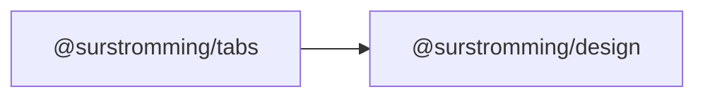

# @surstromming/tabs

Switch between panels of content. Data-driven tab list; each panel is a slot
named after its `value`.

## Dependency graph



## Usage

```vue
<template>
  <Tabs v-model="tab" :tabs="tabs">
    <template #account>Account settings go here.</template>
    <template #password>Change your password here.</template>
  </Tabs>
</template>

<script setup lang="ts">
import { ref } from 'vue'
import { Tabs, type TabItem } from '@surstromming/tabs'

const tab = ref('account')
const tabs: TabItem[] = [
  { label: 'Account', value: 'account' },
  { label: 'Password', value: 'password' },
  { label: 'Billing', value: 'billing', disabled: true },
]
</script>
```

## Props

| Prop          | Type                       | Default      | Notes                                    |
| ------------- | -------------------------- | ------------ | ---------------------------------------- |
| `v-model`     | `string`                   | — (required) | The active tab's `value`                  |
| `tabs`        | `TabItem[]`                | — (required) | `{ label, value, disabled? }`             |
| `variant`     | `solid \| line`            | `solid`      | `solid` = pill in a trough; `line` = underline |
| `orientation` | `horizontal \| vertical`   | `horizontal` | Vertical stacks the list beside the panel  |

`orientation` also swaps the arrow keys: `←/→` for a row, `↑/↓` for a column.

## Slots

One **named slot per tab**, matching its `value` (`#account`, `#password`…).
Only the active panel is rendered — a hidden panel costs nothing, and its
`onMounted` doesn't fire until you actually open it.

## Anatomy

```
div
  ├─ div.list[role=tablist]
  │    └─ button.tab[role=tab]     // .isActive
  └─ div.panel[role=tabpanel]      // <slot :name="model" />
```

## Keyboard

| Key       | Action                                             |
| --------- | -------------------------------------------------- |
| `Tab`     | Enter/leave the tab list — **one** stop, not one per tab |
| `←` / `→` (or `↑` / `↓` when vertical) | Move to the previous/next tab (wraps, skips disabled) |

That's a *roving tabindex*: the active tab has `tabindex="0"`, the rest `-1`.
Without it, a 6-tab bar would cost a keyboard user 6 presses to walk past.

## Tokens

`muted` list background with a `background`-colored active pill,
`muted-foreground` → `foreground` text, `radius(md)` / `radius(sm)`, 3px `ring`
focus ring.

## Tokens

`solid` — `muted` trough, `background` active pill with `shadow(sm)` (dark:
`input` border + fill). `line` — no trough, a 2px `primary` underline (a
side-line when vertical) under the active tab. Both: `muted-foreground` →
`foreground` text, 3px `ring` focus ring.

## Notes

Selecting a tab moves focus to it (standard for automatic-activation tabs).
The tab state is a plain `v-model` — put it in the URL yourself if the tab
should survive a reload.
