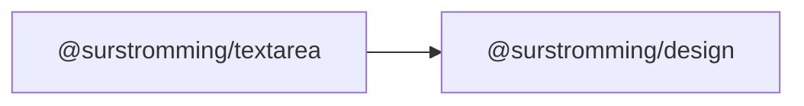

# @surstromming/textarea

Multi-line text input. A native `<textarea>` with the design system's border,
focus ring, invalid and disabled states.

## Dependency graph



## Usage

```vue
<template>
  <Label for="bio">Bio</Label>
  <Textarea id="bio" v-model="bio" rows="4" placeholder="Tell us about yourself" />
</template>

<script setup lang="ts">
import { ref } from 'vue'
import { Textarea } from '@surstromming/textarea'

const bio = ref('')
</script>
```

## Props

| Prop      | Type     | Default | Notes                          |
| --------- | -------- | ------- | ------------------------------ |
| `v-model` | `string` | —       | `defineModel()`; `.trim` works |

Everything else is a native attribute and falls through to the `<textarea>`:
`rows` · `placeholder` · `disabled` · `readonly` · `required` · `maxlength` ·
`aria-invalid` · `name` · `id`.

## Anatomy

```
textarea.root   // border, radius, typography, focus ring, invalid, disabled
```

## States & tokens

Same contract as [`Input`](../input) — resting border `input`, focus ring
`ring` @ 50%, `[aria-invalid='true']` → `destructive` border + ring
(20%, dark 40%), disabled 50% opacity, dark background `input` @ 30%.

- `min-height: spacing(16)`; grows with `rows`.
- **`resize: vertical`** — horizontal resizing breaks the layout the field
  sits in.
- Font is `1rem` on mobile, `0.875rem` from `md` up (anything under 16px makes
  iOS Safari zoom on focus).

## Accessibility

Pair it with a [`Label`](../label) via `for`/`id`. Mark errors with
`aria-invalid="true"` and point at the message with `aria-describedby` — the
styling keys off the same attribute, so there's nothing to keep in sync.
