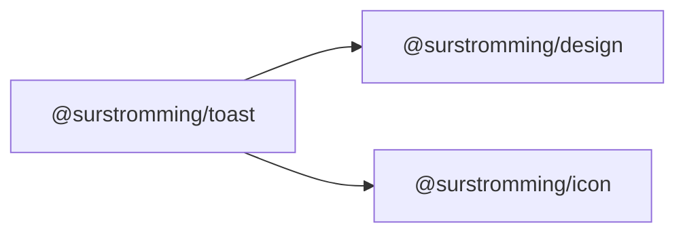

# @surstromming/toast

Transient messages stacked over the page — "Saved", "Upload failed". For a
message that **stays**, use [`Alert`](../alert).

The package is presentational: `Toaster` renders whatever list you hand it and
tells you when a toast wants to go. **The queue lives in your app** (a Pinia
store), not in here — see the demo's `src/stores/toasts.ts`.

## Dependency graph



## Usage

```vue
<!-- App.vue — mounted once -->
<template>
  <Toaster :toasts="toasts.items" @dismiss="toasts.dismiss" />
</template>

<script setup lang="ts">
import { Toaster } from '@surstromming/toast'
import { useToasts } from '@/stores/toasts'

const toasts = useToasts()
</script>
```

```ts
// anywhere
const toasts = useToasts()
toasts.push({ title: 'Saved', description: 'Your changes are live.' })
toasts.push({ title: 'Upload failed', variant: 'destructive', duration: 0 })
```

## `Toaster`

| Prop     | Type          | Default | Notes                                    |
| -------- | ------------- | ------- | ---------------------------------------- |
| `toasts` | `ToastItem[]` | — (required) | The queue, newest last                |


| Emit      | Payload | When                                              |
| --------- | ------- | ------------------------------------------------- |
| `dismiss` | `id`    | A toast timed out or its close button was clicked  |

Teleported to `<body>`, fixed bottom-right, animated with a `TransitionGroup`.

## `Toast`

Rendered by `Toaster`; exported for a one-off toast outside a queue.

| Prop          | Type                   | Default | Notes                            |
| ------------- | ---------------------- | ------- | -------------------------------- |
| `title`       | `string`               | — (required) |                             |
| `description` | `string`               | —       |                                  |
| `variant`     | `info \| destructive`  | `info`  |                                  |
| `duration`    | `number`               | `5000`  | Milliseconds; **`0` = until dismissed** |

| Emit    | When                                        |
| ------- | ------------------------------------------- |
| `close` | The timer elapsed, or the ✕ was clicked      |

**Each toast owns its own timer** and clears it on unmount, so the list never
has to track any — and a toast removed early can't leave a timer behind.

```ts
export interface ToastItem {
  id: number
  title: string
  description?: string
  variant?: ToastVariant
  duration?: number
}
```

## Accessibility

The viewport is `aria-live="polite"` and each toast is `role="status"` — new
messages are announced without stealing focus. Every toast has a labelled
close button; an error toast should use `duration: 0` so it can't vanish
before it's read.
