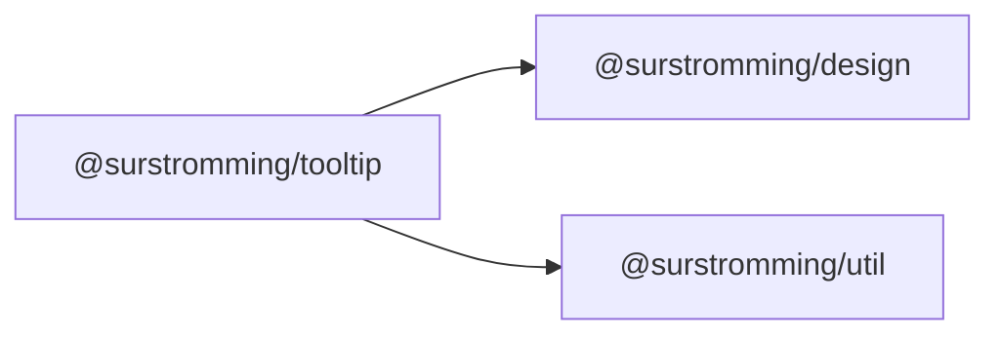

# @surstromming/tooltip

A short label that appears on hover or focus — the name of an icon button, a
hint on a truncated value. Text only; anything richer is a
[`Popover`](../popover).

## Dependency graph



## Usage

```vue
<template>
  <Tooltip content="Add to library" side="bottom">
    <Button size="icon" aria-label="Add"><Icon :icon="Plus" /></Button>
  </Tooltip>
</template>

<script setup lang="ts">
import { Tooltip } from '@surstromming/tooltip'
import { Button } from '@surstromming/button'
import { Icon } from '@surstromming/icon'
import { Plus } from 'lucide'
</script>
```

## Props

| Prop      | Type                              | Default | Notes                                   |
| --------- | --------------------------------- | ------- | --------------------------------------- |
| `content` | `string`                          | — (required) | The label text                     |
| `side`    | `top \| right \| bottom \| left`  | `top`   | Preferred edge — flips to the opposite one when there's no room |
| `delay`   | `number`                          | `300`   | ms before it shows                       |
| `v-model:open` | `boolean`                    | `false` | Optional — usually left to hover/focus    |

## Slots

| Slot      | Description                                          |
| --------- | ---------------------------------------------------- |
| `default` | The trigger. Keep it focusable so keyboard users get the tip too. |

## Behavior

- Shows after `delay` on `mouseenter`/`focusin`; hides **immediately** on
  leave, blur or `Escape`. A pointer passing through never flashes it; the
  pending timer is cancelled on the way out.
- The tip is `pointer-events: none`, so it can't eat the hover it describes.
- The tip **teleports to `<body>`** and is positioned `fixed` from the
  trigger's measured rect (`useAnchoredTip`), re-measured on scroll and resize.
  Left inside the trigger's own box it was clipped by any `overflow` ancestor —
  and every page here scrolls through a `ScrollArea`, so a trigger near the top
  of one had its whole tip cut away.
- It **flips** rather than shifting: `side` is a preference, and when the tip
  won't fit there it moves to the opposite edge (only if *that* one fits —
  otherwise flipping would just move the problem). The cross axis is then
  clamped 8px inside the viewport. This is the opposite of `Popover`, which
  shifts and stays on the side it was asked for: a popover is a surface you
  work in, a tip is a label.

## Tokens

`primary` / `primary-foreground` (the inverted chip shadcn uses), `radius(md)`,
0.75rem type, `z-index(tooltip)` — the ladder's top rung, so it clears every
overlay including a dialog's own controls.

## Notes

- The trigger must be focusable (a `Button`, a link) for the tip to be
  keyboard-reachable — a tooltip on a bare `<span>` is mouse-only.
