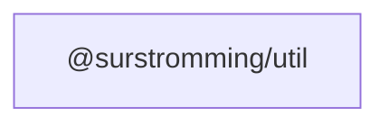

# @surstromming/util

Shared non-component helpers.

## Dependency graph



## Usage

```ts
import { isBrowser, isMobile, MOBILE_BREAKPOINT } from '@surstromming/util'
```

- `isBrowser` — `true` outside SSR.
- `isMobile` — reactive ref: the viewport is below the design `md` breakpoint.
- `MOBILE_BREAKPOINT` — `768`, mirrors `$screens.md` in the design package.
